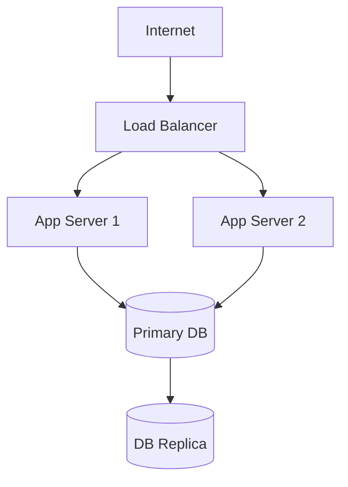

## Environments

| Environment | Purpose | URL |
|---|---|---|
| `local` | Developer laptops via Docker Compose | `localhost` |
| `staging` | Pre-production testing | _TBD_ |
| `production` | Live system | _TBD_ |

## Infrastructure Overview

_Document the cloud provider, VMs, container orchestration, and networking topology._

## Container Orchestration

_Docker Compose (local) / Kubernetes (staging + prod) — describe the approach._

## Infrastructure as Code

_Document where IaC scripts/configs live and how to apply changes._

## Secrets Management

_How secrets are stored and injected (e.g. environment variables, Vault, cloud secrets manager)._

## Related Docs

- [Docker](../deployment/docker.md)
- [Kubernetes](../deployment/kubernetes.md)
- [Networking](./networking.md)
