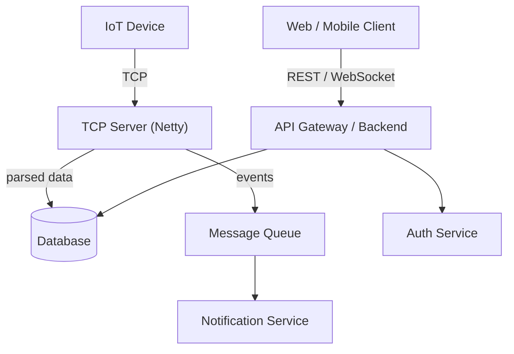

## What is Ceycode's system?

_Describe the product and what problem it solves at a high level._

## Service Map

_Expand this diagram with real service names, ports, and protocols._

## Services at a Glance

| Service | Responsibility | Tech | Port(s) |
|---|---|---|---|
| TCP Server | Receives IoT device connections, decodes packets | Java / Netty | `5000` |
| Auth Service | Issues and validates tokens | _TBD_ | `8081` |
| Notification Service | Sends alerts/push notifications | _TBD_ | `8082` |
| API Backend | REST API for web/mobile clients | _TBD_ | `8080` |

_Fill in real values; add rows for every service._

## Data Flow Summary

1. Device connects to the TCP server over a persistent TCP connection.
2. TCP server decodes binary packets into structured events.
3. Events are written to the database and optionally published to a message queue.
4. Downstream services consume queue messages or poll the DB.
5. Clients query the API backend for data.

## External Dependencies

| System | Purpose |
|---|---|
| _e.g. Meitrack_ | GPS device integration |
| _e.g. Ultravision_ | Video/camera feed |

## Related Docs

- [Backend Architecture](./backend-architecture.md)
- [TCP Server](../services/tcp-server.md)
