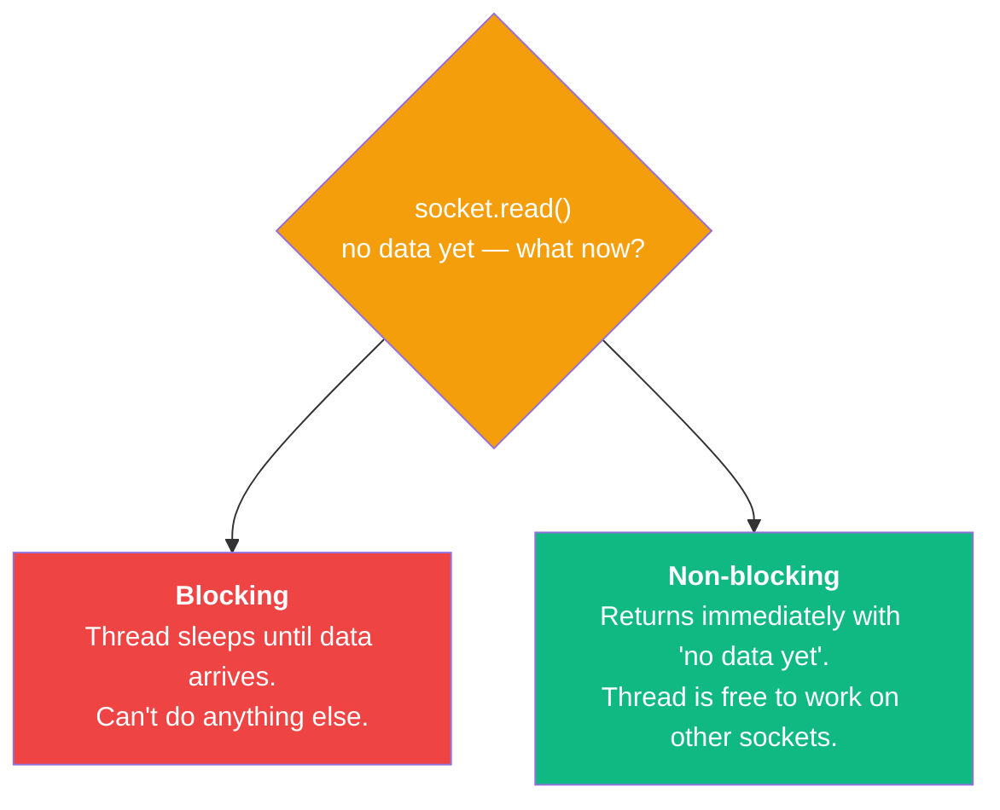
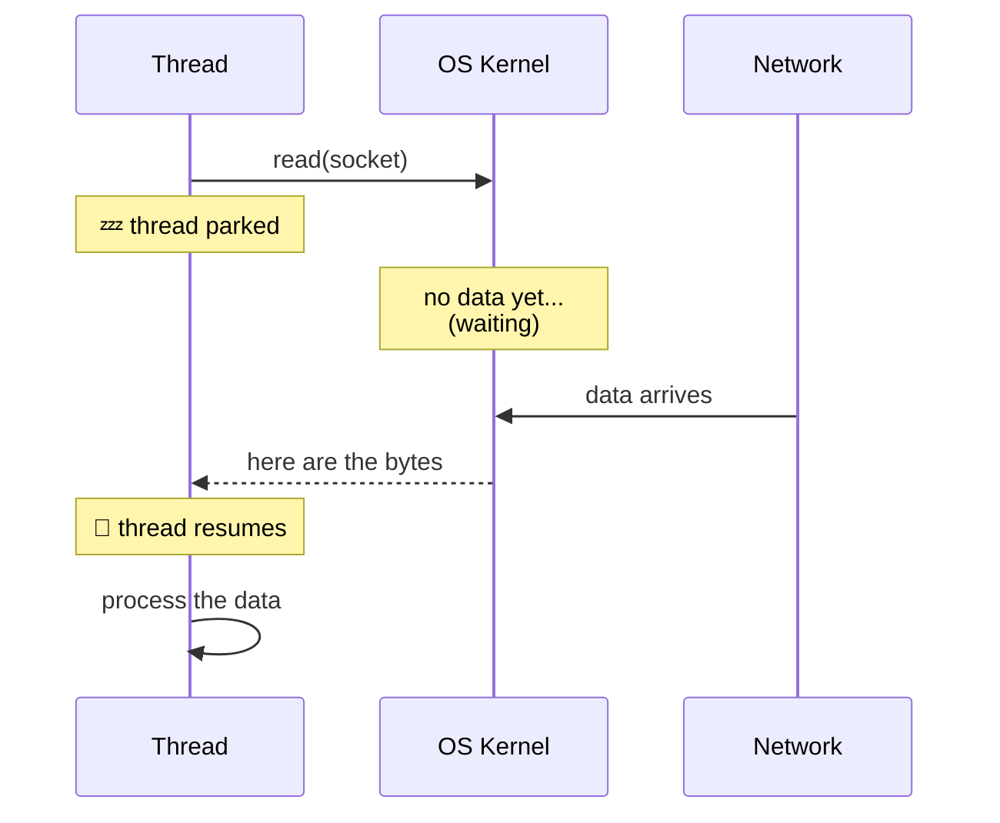
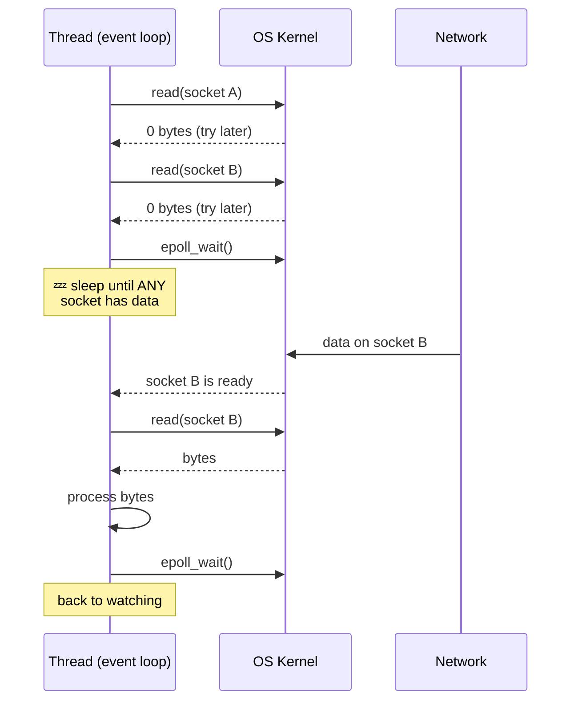
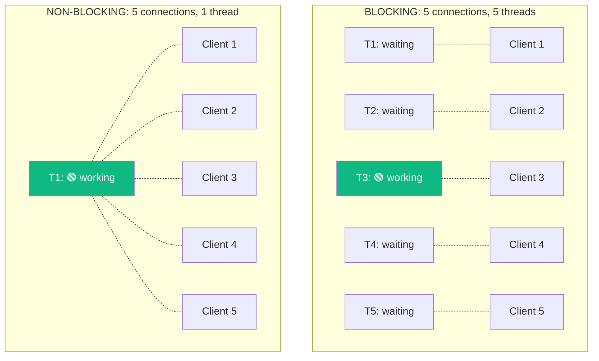
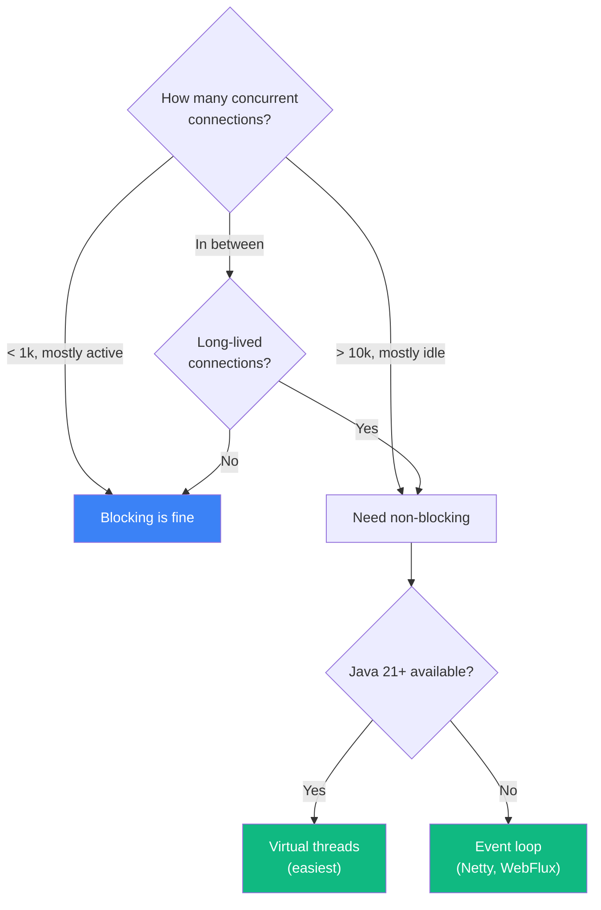

# Blocking vs Non-Blocking I/O

:::tip Summary

- **Blocking I/O:** the thread sits and waits for the network. Simple to write, but every active connection occupies a whole thread.
- **Non-blocking I/O:** the OS tells you when a socket is ready. One thread can juggle thousands of sockets, but the code is harder to write.
- This single trade-off explains 90% of the differences you'll see between server frameworks (Tomcat vs Netty, Spring MVC vs WebFlux, Express vs Node's raw async).

:::

:::note Prerequisites

[2. Sockets](./sockets) · [3. Threads & Concurrency](./threads-and-concurrency)

:::

## The core question

When your server thread calls `socket.read()` and the client hasn't sent any data yet, **what does the thread do?**

There are two possible answers, and each answer creates an entirely different style of server.

<div style={{textAlign: 'center'}}>



</div>

That's the entire concept. Everything else is consequences.

## Blocking I/O, visualized

<div style={{textAlign: 'center'}}>



</div>

While the thread is blocked, it's **using up a thread slot but doing zero work**. The CPU is happy to run other threads, but *this specific thread* is wasted until data shows up.

If you have a connection where the client sends one message every 5 seconds, that thread sits idle for almost all 5 seconds. With 10,000 such connections, you'd need 10,000 threads — and we already saw in [doc 3](./threads-and-concurrency) that that's a non-starter.

**This is fine when:** requests are short and arrive frequently. The thread doesn't sit idle long because work always shows up.

**This is bad when:** connections are long-lived but mostly quiet (chat, IoT, streaming), or when each request involves a lot of waiting (slow database, slow downstream API).

## Non-blocking I/O, visualized

<div style={{textAlign: 'center'}}>



</div>

The thread doesn't park on any individual socket. Instead, it asks the OS: *"tell me when any of these 10,000 sockets has something for me."* That single call (`epoll_wait` on Linux, `kqueue` on macOS/BSD, IOCP on Windows) wakes the thread up only when there's actual work to do.

Result: **one thread can productively serve thousands of mostly-idle sockets.** No more 10k threads, no more 10 GB of stack memory.

**This is fine when:** you have lots of concurrent connections, most of which are mostly idle (real-time apps, push services, proxies).

**This is bad when:** the work itself is CPU-heavy and blocks the loop. Any synchronous file read, synchronous DB call, or `Thread.sleep` in your event-loop code halts *every* connection on that thread.

## Side-by-side: thread utilization

This is the picture worth a thousand words.

<div style={{textAlign: 'center'}}>



</div>

In the blocking model, 4 of 5 threads are doing nothing — but they still take memory and a thread slot. In the non-blocking model, 1 thread serves all 5 clients with no idle time.

Scale that to 10,000 clients and the difference becomes existential.

## The OS primitives behind the scenes

You almost never call these directly, but knowing they exist demystifies how non-blocking I/O actually works:

| OS | Primitive | What it does |
|---|---|---|
| **Linux** | `epoll` | "Tell me which of these N file descriptors are ready." O(1) per ready FD. |
| **macOS/BSD** | `kqueue` | Same idea, different API. |
| **Windows** | `IOCP` (I/O Completion Ports) | Slight variant — the OS finishes the I/O and then notifies you. |
| **POSIX (legacy)** | `select`, `poll` | The old way. O(N) per call — fine for small N, terrible for 10k+. |

Java's `java.nio.channels.Selector` is a portable wrapper over these. Netty uses it. Spring WebFlux's Reactor Netty uses it.

## The hidden trade-off: code complexity

Here's the same logic in both styles, in pseudocode:

**Blocking — looks like normal code:**

```java
byte[] request = socket.read();         // thread parks here
String result = database.query(request); // thread parks again
socket.write(result);                    // and again
```

**Non-blocking — chain of callbacks (old style):**

```java
socket.readAsync(request -> {
    database.queryAsync(request, result -> {
        socket.writeAsync(result, done -> {
            // ...
        });
    });
});
```

**Non-blocking — reactive/Promise style (modern):**

```java
socket.read()
      .flatMap(request -> database.query(request))
      .flatMap(result -> socket.write(result))
      .subscribe();
```

**Non-blocking — virtual threads (Java 21+, looks blocking again!):**

```java
byte[] request = socket.read();         // virtual thread "parks"
String result = database.query(request); // but the OS thread isn't blocked
socket.write(result);                    // it's running other virtual threads
```

Virtual threads / coroutines are the modern answer: **write blocking-style code, get non-blocking performance.**

## When does the trade-off flip?

<div style={{textAlign: 'center'}}>



</div>

| Scenario | Best fit |
|---|---|
| Internal REST API, ~100 RPS | Blocking (Tomcat + Spring MVC) — keep it simple |
| Public API, ~1k–5k RPS | Blocking with a tuned thread pool — or virtual threads |
| Real-time chat, 50k concurrent WebSockets | Non-blocking (Netty + WebFlux) |
| IoT server, 100k devices each pinging hourly | Non-blocking — long-lived idle connections kill blocking |
| Slow downstream API calls (3s+) | Non-blocking, or virtual threads — don't waste threads waiting |
| CPU-heavy work (image processing, ML inference) | Either works; isolate CPU work onto its own thread pool |

## Common confusions

**"Isn't non-blocking always better?"**
No. For low-concurrency workloads, blocking code is simpler, easier to debug, and just as fast. Premature reactive code is a known way to hurt yourself.

**"Does 'async' mean non-blocking?"**
"Async" usually means "this function returns a Future/Promise instead of the value directly." That's almost always implemented on top of non-blocking I/O — but the code style is what's different.

**"Why is Node.js so fast then?"**
Node was non-blocking from day one (its whole runtime is one event loop). For I/O-heavy workloads, it scales without ever needing a thread pool. The cost is that any CPU-heavy work in JS land freezes everything.

**"My Spring MVC controller hits a slow API. Should I switch to WebFlux?"**
Try virtual threads first (Spring Boot 3.2+). Same code, much better scaling. WebFlux is worth it only if you genuinely need backpressure / streaming semantics, or if your whole stack is reactive.

## Where this lands in the rest of the series

You now have the conceptual key that unlocks the next four docs:

- **[Protocols](./protocols)** — HTTP, WebSocket, etc. can all run on either model. The choice of protocol and the choice of I/O model are separate.
- **[Server types](./server-types)** — different server types tend to favor different I/O models (e.g., WebSocket servers almost always pick non-blocking).
- **[Tomcat vs Netty](./tomcat-vs-netty)** — Tomcat is blocking (thread per request); Netty is non-blocking (event loop). This is now a one-line summary instead of mystery.
- **[Spring ecosystem](./spring-ecosystem)** — Spring MVC sits on blocking I/O; Spring WebFlux sits on non-blocking. Same Spring, different I/O choice.

If you only remember one thing from this whole series: **a thread blocked on I/O is a thread doing nothing.** Modern server design is mostly about not letting that happen.

---

**← Previous** [3. Threads & Server Concurrency](./threads-and-concurrency)
**Next →** [5. Protocols: TCP, HTTP, WebSocket](./protocols)
