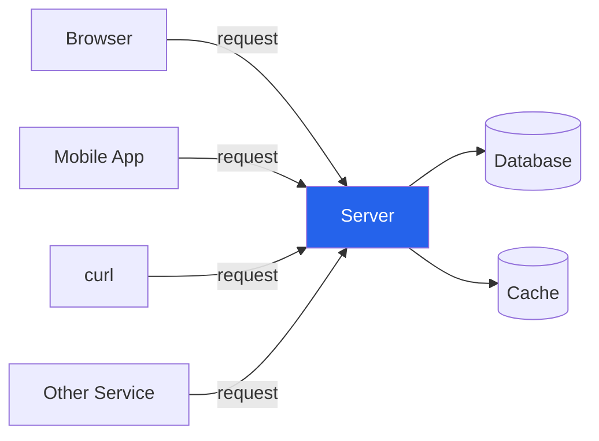
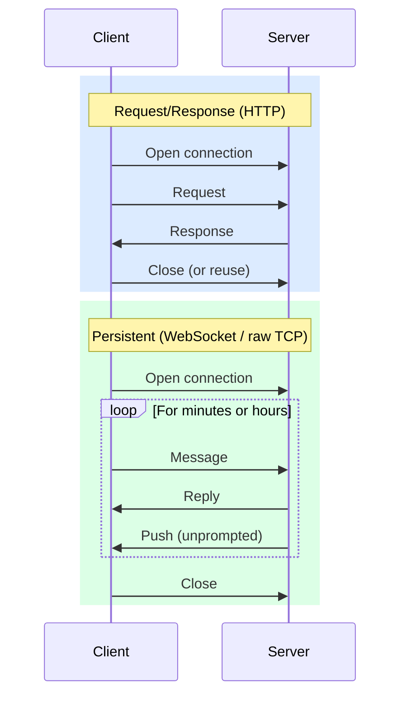
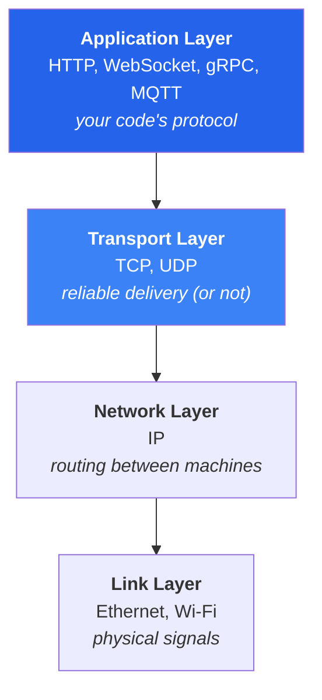
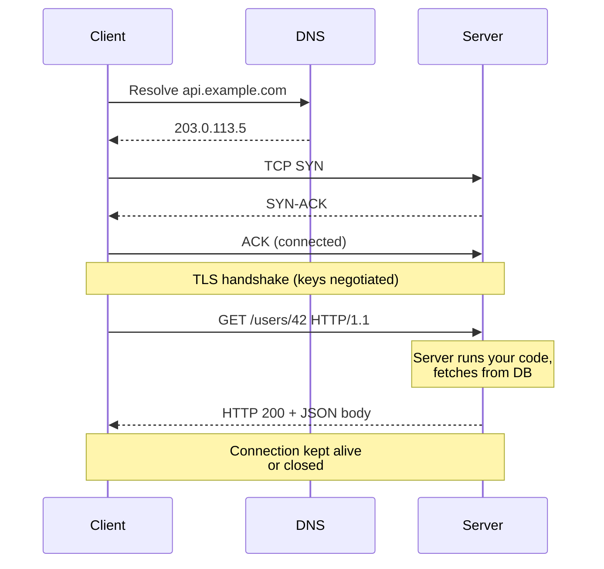

# Client-Server Fundamentals

:::tip TL;DR

- A **client** initiates a conversation; a **server** waits for one.
- That conversation can be one-shot (request/response) or persistent (a long-lived stream).
- Everything else in this series — sockets, threads, protocols, frameworks — is just *how* you make that conversation fast, concurrent, and reliable.

:::

:::note Series

This is doc **1 of 8** in the [Server Architecture](/category/server-architecture) series. Read in order if you're new; jump if you're not.

:::

## The model

A **client** is anything that wants to *do* something — fetch data, send a message, open a stream. It knows where the server lives (an IP address and a port).

A **server** is a program that *waits*. It listens for incoming connections, then handles them — maybe by serving one request and disconnecting, maybe by holding the connection open for hours.

That's it. That's the whole model. Everything else in this series exists to make that conversation **fast** (handle thousands of clients at once), **reliable** (don't drop data), and **maintainable** (don't lose your mind writing it).

## Request/response vs persistent connections

The shape of the conversation matters more than any framework choice you'll make later.

**Request/response** is one-shot. Client asks, server answers, done. HTTP is the canonical example. Easy to scale horizontally because every request is independent.

**Persistent connections** stay open. Either side can send a message at any time. WebSocket, raw TCP, MQTT — these are persistent. Used when you need real-time push (chat, stock prices, game state) or when devices need to keep a long-lived link (GPS trackers, IoT sensors).

The trade-off:

| | Request/Response | Persistent |
|---|---|---|
| **Memory per client** | Low (state lives in DB) | Higher (server holds connection state) |
| **Scalability** | Easy — add more servers | Harder — clients are pinned to one server |
| **Latency for push** | High (client must poll) | Low (server pushes instantly) |
| **Typical use** | REST APIs, traditional web | Chat, live dashboards, IoT, games |

## Where the network actually sits

When your code writes bytes to a socket, those bytes travel through a stack of layers. You don't write each layer — the OS handles most of it — but knowing which layer does what saves a lot of confusion.

You'll mostly think about the **application** and **transport** layers. The rest is the OS's and the network's problem.

A useful rule: HTTP, WebSocket, and gRPC are all *application-layer* protocols. All three sit on top of **TCP**, the transport-layer protocol that gives them a reliable byte stream. They just layer different conventions on top.

## The journey of one HTTP request

What actually happens when you hit `https://api.example.com/users/42`?

1. **DNS lookup** — your machine resolves the hostname to an IP
2. **TCP handshake** — the famous SYN / SYN-ACK / ACK exchange opens a reliable byte stream
3. **TLS handshake** — both sides negotiate encryption (skipped for plain HTTP)
4. **HTTP request** — your client writes `GET /users/42` plus headers onto the stream
5. **Server work** — your code runs, fetches data, builds a response
6. **HTTP response** — bytes flow back: status line, headers, body
7. **Connection** — kept alive for reuse, or closed

Every server-side technology — Tomcat, Netty, nginx, Node.js — does steps 4–6 differently. That's what the rest of this series is about.

## "Client" and "server" are roles, not boxes

A single program is often both. Your microservice that handles `/orders` is a *server* to the browser. But when it calls the payments service, it's a *client*. Same process, different role.

This matters because the same primitives — sockets, threads, protocols — apply on both sides. Learning servers teaches you clients for free.

## Common confusions

**Is "server" the machine or the program?**
In ops contexts, "server" often means hardware. In code contexts, it means a *program that listens*. We'll always mean the program.

**Is a database a server?**
Yes. Postgres, Redis, MongoDB all listen on a port and serve queries. They use the same client-server model, just with their own protocols.

**Does the client always start the conversation?**
Always. That's the definition. Even in WebSocket, where the server can push messages later, the client opens the connection first.

**Is "the cloud" different?**
No. AWS, GCP, your laptop — they're all just machines running listening programs. The cloud is logistics, not a different model.

## What you'll learn next

Now you understand the *what*. The rest of the series is about the *how*:

- **[Sockets](./sockets)** — the OS abstraction that "open a connection" actually maps to.
- **[Threads](./threads-and-concurrency)** — how one server handles thousands of clients at once.
- **[Blocking vs Non-Blocking I/O](./blocking-vs-non-blocking)** — the single most important concept for understanding modern server design.

---

**Next →** [2. Sockets: The OS Network Endpoint](./sockets)
