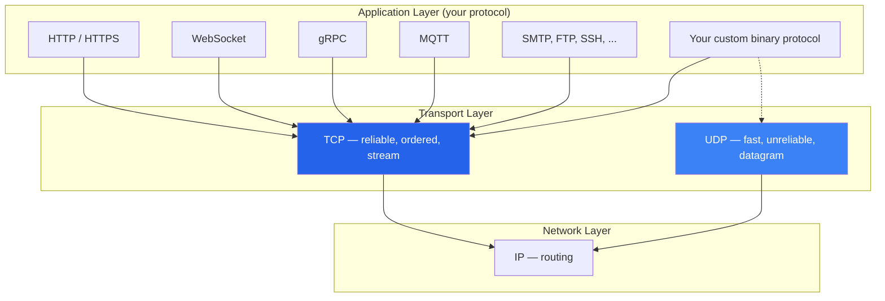
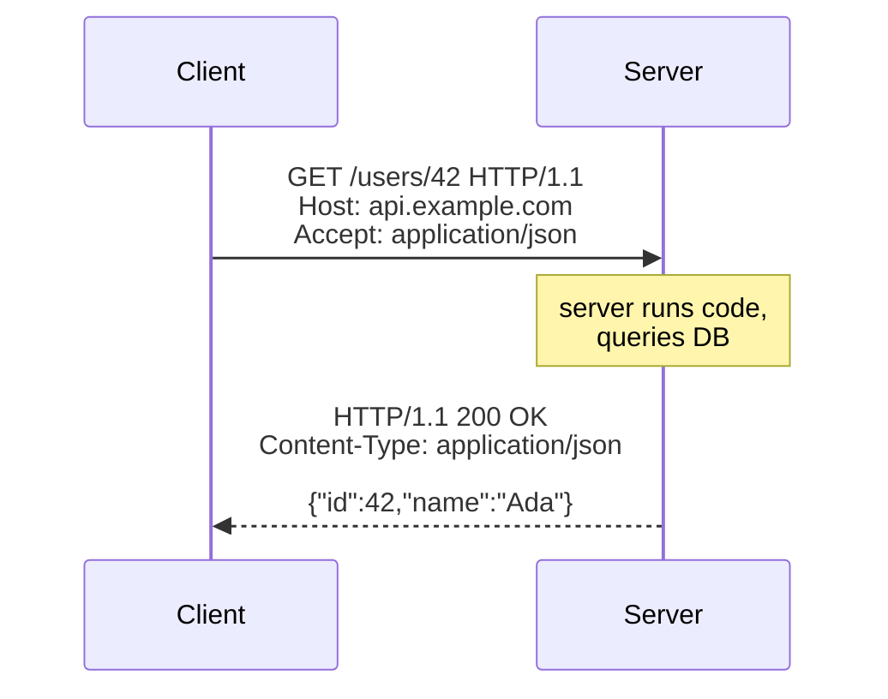
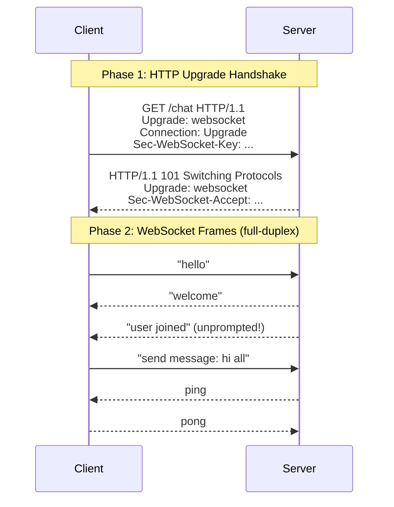
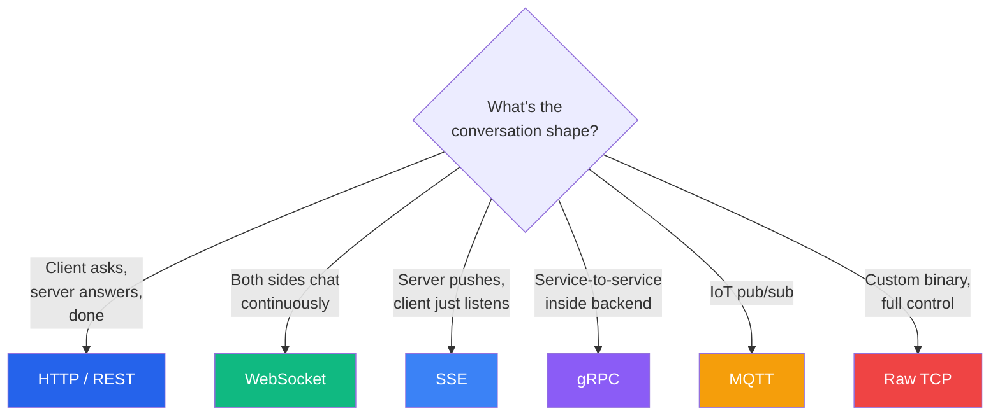

# Protocols: TCP, HTTP, WebSocket

:::tip Summary

- **TCP** is the foundation: a reliable, ordered stream of bytes. Everything else is layered on top.
- **HTTP** is request/response messages on top of TCP. Used for ~everything on the web.
- **WebSocket** starts as HTTP, then upgrades into a persistent, bidirectional message stream — still on TCP.
- The protocol choice mostly determines **conversation shape**: one-shot vs streaming, server-can-push vs client-must-poll.

:::

:::note Prerequisites

[2. Sockets](./sockets) · [4. Blocking vs Non-Blocking I/O](./blocking-vs-non-blocking)

:::

## The protocol stack at a glance

<div style={{textAlign: 'center'}}>



</div>

Almost every protocol you care about runs on **TCP**. The few exceptions (DNS, video streaming, gaming) use **UDP** for speed at the cost of reliability.

## TCP: the foundation

**TCP (Transmission Control Protocol)** gives you a **reliable, ordered, bidirectional stream of bytes** between two endpoints. That's the entire contract:

| Property | What TCP guarantees |
|---|---|
| **Reliable** | If you send bytes, they arrive — TCP retransmits lost packets. |
| **Ordered** | Bytes arrive in the order you sent them. |
| **Stream** | No message boundaries. If you write `[hello]` then `[world]`, the receiver might read `helloworld` in one chunk, or `he`, `llowor`, `ld` in three. |
| **Bidirectional** | Both sides can write at any time. |
| **Connection-oriented** | A 3-way handshake opens the connection before any data flows. |

That last property — **TCP is a byte stream, not a message stream** — trips up a lot of developers. If you're writing a custom TCP protocol, *you* are responsible for framing: deciding where one logical message ends and the next begins. Common approaches: length-prefixed messages (4-byte length, then payload), or delimiter-based (read until newline).

Everything above TCP (HTTP, WebSocket, gRPC) is just *a convention for framing and interpreting bytes* on top of that stream.

## HTTP: the universal request/response protocol

HTTP is **text-based**, **stateless**, and **request/response shaped**. Every interaction is one request from client + one response from server.

<div style={{textAlign: 'center'}}>



</div>

A raw HTTP/1.1 request actually looks like this on the wire — plain text, lines separated by `\r\n`:

```
GET /users/42 HTTP/1.1
Host: api.example.com
Accept: application/json

```

The blank line tells the server "headers are done, body follows" (no body here since it's a GET).

### HTTP/1.1 vs HTTP/2 vs HTTP/3

| Version | What changed | Why it matters |
|---|---|---|
| **HTTP/1.1 (1997)** | Persistent connections (keep-alive), pipelining | One TCP connection can serve many requests in sequence |
| **HTTP/2 (2015)** | Multiplexing, binary frames, header compression, server push | Many requests in parallel on one connection — fixes head-of-line blocking |
| **HTTP/3 (2022)** | Runs on **QUIC** (UDP), not TCP | Avoids TCP head-of-line blocking entirely; faster handshakes |

For most server code, the version is **transparent** — your framework speaks all three, and the client picks. You only think about it when tuning performance or choosing between gRPC (requires HTTP/2) and REST (works on any version).

### HTTP is stateless

The server doesn't inherently remember anything between requests. Each `GET /users/42` is independent — no concept of "this is the same client as before."

Statefulness on top of HTTP is bolted on: cookies, session tokens, JWTs. The protocol itself doesn't care.

## WebSocket: persistent, bidirectional, message-based

<div style={{textAlign: 'center'}}>



</div>

WebSocket starts as a regular HTTP request (so it can pass through firewalls and proxies), then **upgrades** the same TCP connection into a different protocol where either side can send messages at any time.

Key differences from HTTP:

| | HTTP | WebSocket |
|---|---|---|
| **Connection lifetime** | One request, then close (or pooled) | One handshake, then persistent for the whole session |
| **Direction** | Client must initiate every exchange | Either side can send at any time |
| **Message shape** | Headers + body, parsed each time | Lightweight frames (a few bytes overhead) |
| **State** | Stateless | Stateful — server tracks every open connection |
| **Best for** | REST APIs, traditional web | Chat, live dashboards, multiplayer games, collaborative editing |

WebSocket is what you reach for when **the server needs to push data to the client without being asked**. Without WebSocket, the only HTTP-based alternative is polling ("any new messages?" every 2 seconds), which is wasteful and laggy.

## Other protocols worth knowing about

### gRPC

gRPC is built on **HTTP/2** and uses **Protocol Buffers** (a compact binary format) instead of JSON.

| Why use it | Why not |
|---|---|
| Compact wire format (smaller than JSON) | Browsers can't speak it natively (need gRPC-Web bridge) |
| Strongly typed contracts (`.proto` files) | Tooling adds complexity |
| Bidirectional streaming built in | Less debuggable than HTTP (binary, not text) |
| Code generation for many languages | Overkill for simple internal APIs |

gRPC's sweet spot: **service-to-service communication inside a backend**, where you control both ends and want type safety + performance.

### Server-Sent Events (SSE)

A simpler alternative to WebSocket when you only need **server → client** push (no client → server messages on the same connection). It's just HTTP with a long-lived response and a specific content type. Used by stock tickers, log streamers, server-side AI streaming, etc.

### MQTT

A lightweight **pub/sub** protocol on TCP. Designed for IoT devices on flaky networks with tiny resource budgets. Has built-in topics, QoS levels, and last-will messages.

### Custom binary protocols

When you control both endpoints and need extreme efficiency (think: GPS trackers, financial market data), you often define your own framing on top of raw TCP. This is what the [TCP server](./server-types) doc is about.

## Picking the right protocol

<div style={{textAlign: 'center'}}>



</div>

Quick comparison table:

| Protocol | Persistent? | Bidirectional? | Format | Typical use |
|---|---|---|---|---|
| **HTTP/1.1** | Pooled | No (client initiates) | Text | REST APIs, web pages |
| **HTTP/2** | Yes (multiplexed) | No (still req/resp) | Binary | Same as HTTP/1.1, faster |
| **HTTP/3** | Yes (over QUIC/UDP) | No | Binary | Same again, faster on flaky networks |
| **WebSocket** | Yes | Yes | Frames (text or binary) | Chat, real-time UI |
| **gRPC** | Yes | Yes (streaming variants) | Protobuf (binary) | Backend microservices |
| **SSE** | Yes | One-way (server → client) | Text (HTTP) | Live feeds, log streaming |
| **MQTT** | Yes | Yes (via broker) | Binary, tiny | IoT devices |
| **Raw TCP** | Yes | Yes | Whatever you define | Custom binary protocols |

## Common confusions

**"Is HTTPS a different protocol?"**
No. HTTPS is just HTTP with TLS encryption added underneath. The HTTP semantics are identical. The TLS layer sits between HTTP and TCP.

**"Why is WebSocket still in HTTP's family then?"**
Because the **handshake** is an HTTP request. After the handshake, the protocol switches — but reusing HTTP for the upgrade is what lets WebSocket pass through firewalls, proxies, and load balancers that only understand HTTP.

**"Is gRPC just better HTTP?"**
Not exactly. gRPC is opinionated about type contracts and only works with HTTP/2. If you need browser support or schema-less flexibility, REST over HTTP is still the default.

**"My TCP server keeps getting partial messages — is that a bug?"**
No, that's the byte-stream property doing its job. You need to design a framing scheme (length-prefixed or delimited) so your code knows where messages end.

**"Should I write a custom protocol on raw TCP?"**
Rarely. Existing protocols (HTTP, WebSocket, gRPC, MQTT) cover most needs. Custom protocols make sense for very specific cases: hardware devices that can't speak HTTP, ultra-low-latency trading, or proprietary integrations.

## Where this lands in the series

Now that you know what kinds of conversations exist, you can read the next doc and **map each conversation shape to a server type**:

- HTTP → web server
- WebSocket → WebSocket server (often on top of a web server)
- Raw TCP → TCP server (for IoT, hardware, custom)
- gRPC → gRPC server (HTTP/2 under the hood)

---

**← Previous** [4. Blocking vs Non-Blocking I/O](./blocking-vs-non-blocking)
**Next →** [6. Server Types & When to Use Each](./server-types)
