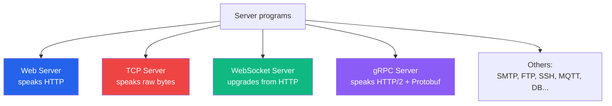
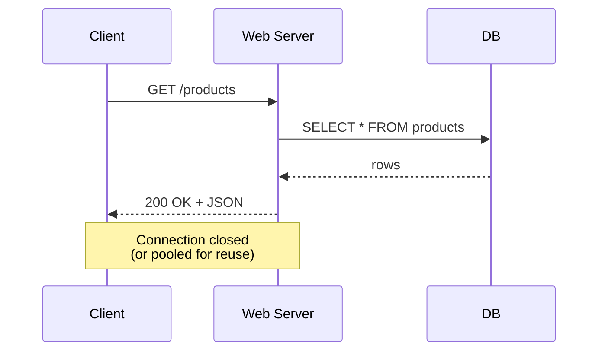
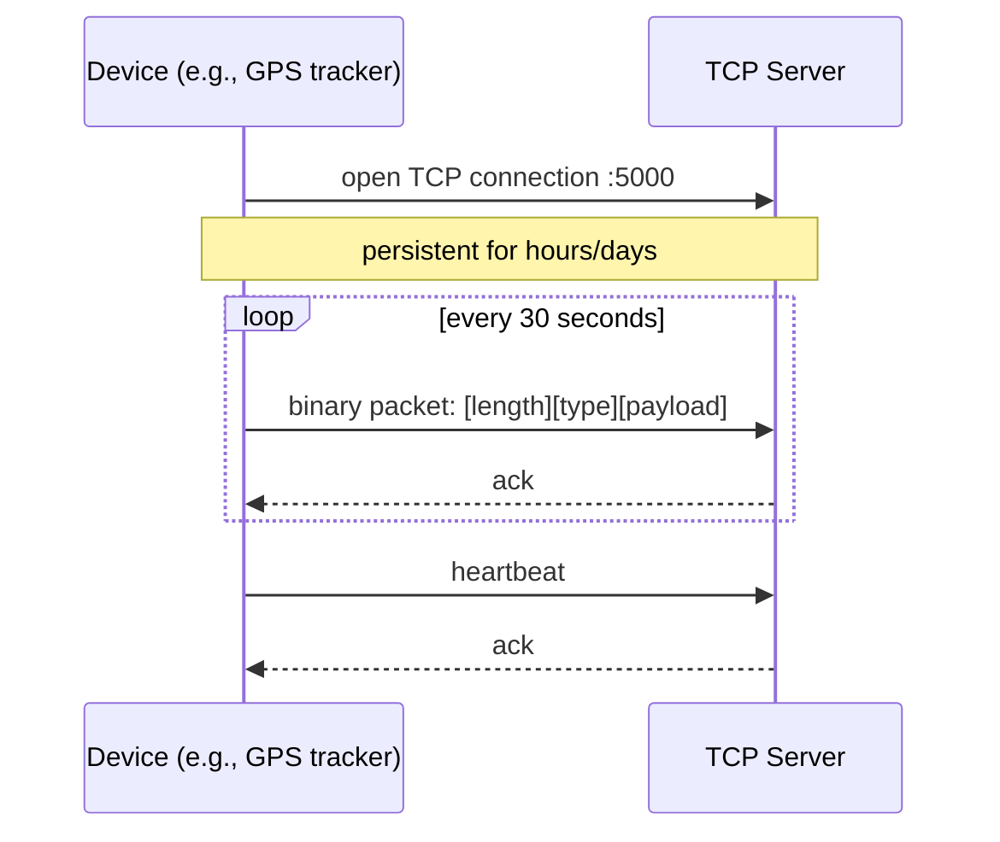
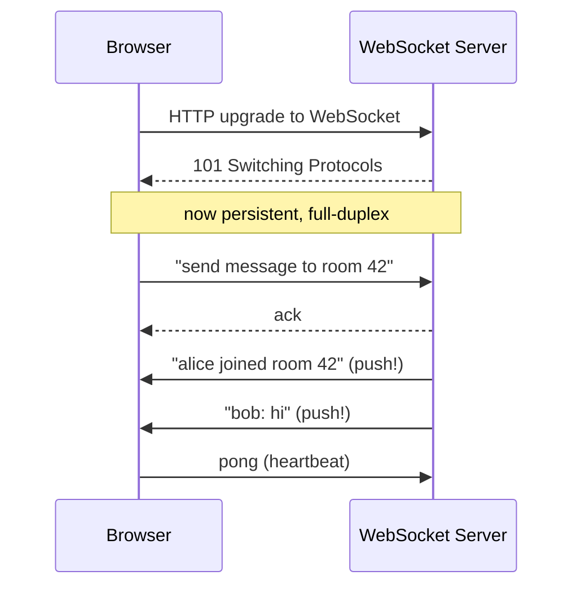
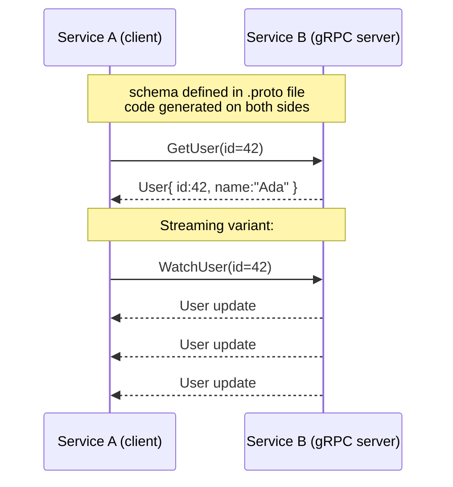
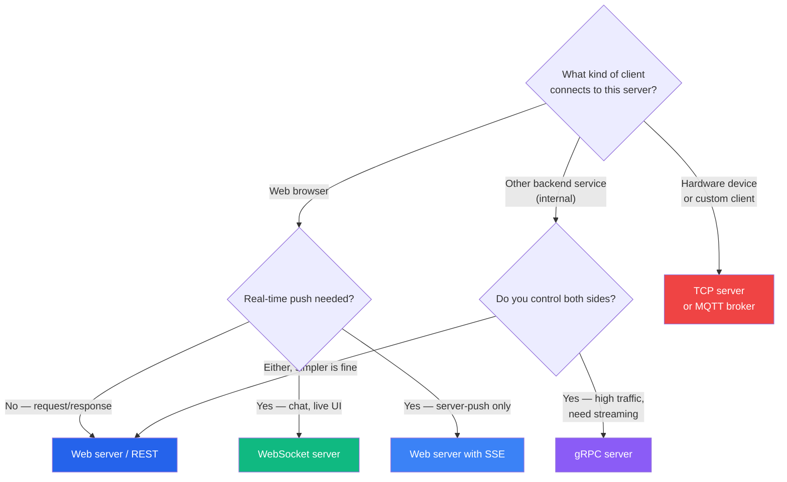
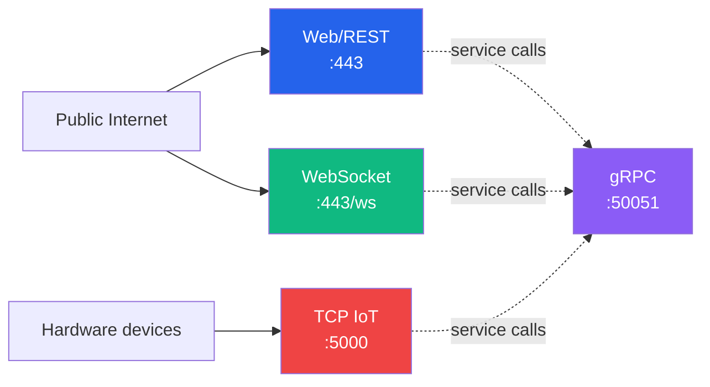

# Server Types & When to Use Each

:::tip Summary

- A **web server** speaks HTTP — the default for ~90% of use cases.
- A **TCP server** speaks a custom binary protocol on raw TCP — used for hardware, IoT, and ultra-low-latency systems.
- A **WebSocket server** holds persistent, bidirectional connections — for chat, live dashboards, multiplayer.
- A **gRPC server** is HTTP/2 with strict schemas — for service-to-service backend calls.
- The choice is driven by the **conversation shape** ([protocol](./protocols)), not by language or framework.

:::

:::note Prerequisites

[5. Protocols](./protocols)

:::

## A "server" is just a category — there are many shapes

Up to now we've used "server" loosely to mean "a program that listens on a port." But that program can be specialised in different ways depending on what it's listening for.

The category mostly depends on the **protocol** you settled on (or were forced into). Within each category, you then choose a framework — Spring MVC, Express, FastAPI, Netty, etc.

## Web server (HTTP / HTTPS)

The most common server type, and the default for almost any backend you build today.

**What it does:** accepts HTTP requests, runs your code, sends HTTP responses.

**Examples in the wild:**
- REST APIs (`/users`, `/orders`)
- Server-side rendered HTML pages
- Static file servers (nginx, Caddy)
- Backend-for-frontend services

**Common frameworks/engines:**
- **Java:** Tomcat, Jetty, Undertow (engines) + Spring MVC, Spring WebFlux (frameworks)
- **Node.js:** Express, Fastify, Koa
- **Python:** FastAPI, Flask, Django
- **Go:** the standard library `net/http`, plus Gin / Echo
- **Rust:** Axum, Actix
- **C#:** ASP.NET Core

**When to use:** the default. If you don't have a strong reason to pick another type, use this.

## TCP server (raw bytes, custom protocol)

A server that opens a TCP port and reads/writes bytes directly, without HTTP on top.

**What it does:** parses a custom binary (or text) protocol over a raw TCP stream. You decide the framing — usually length-prefixed messages or delimiter-terminated ones.

**Examples in the wild:**
- IoT and hardware integrations (GPS trackers, sensors, payment terminals)
- Financial market data feeds
- Database protocols (Postgres, MySQL, Redis all use custom TCP protocols)
- Game servers (sometimes — many now use UDP or WebSocket instead)
- Mail servers (SMTP, IMAP, POP3)

**Common frameworks/engines:**
- **Java:** Netty (overwhelmingly the default), Spring Integration TCP
- **Node.js:** built-in `net` module
- **Go:** `net` package
- **Rust:** Tokio
- **Python:** `asyncio` streams, Twisted

**When to use:**
- Devices/hardware that **can't speak HTTP** (bandwidth or chip constraints)
- You need **persistent connections** with **tiny per-message overhead**
- You're implementing a database, message broker, or other infrastructure
- You need **microsecond-level latency** (HFT-style)

**When NOT to use:** anything client-browser-facing. Browsers can't make raw TCP connections — they only do HTTP and WebSocket.

## WebSocket server

A server that accepts WebSocket connections (which start as HTTP and upgrade) and holds them open for bidirectional messaging.

**What it does:** maintains thousands of long-lived connections; routes messages between clients (often via pub/sub or in-memory channels).

**Examples in the wild:**
- Chat apps (Slack, Discord, WhatsApp Web)
- Live dashboards (trading platforms, observability tools)
- Multiplayer games (in browsers)
- Collaborative editing (Google Docs, Figma)
- Real-time notifications

**Common frameworks/engines:**
- **Java:** Spring WebSocket (servlet-based) or Spring WebFlux + Reactor Netty (reactive)
- **Node.js:** `ws`, `socket.io`
- **Python:** `websockets`, FastAPI WebSocket support
- **Go:** `gorilla/websocket`, `nhooyr/websocket`
- **C#:** SignalR

**Implementation note:** WebSocket servers almost always need [non-blocking I/O](./blocking-vs-non-blocking) — you'll have thousands of mostly-idle connections, and one thread per connection won't scale.

**When to use:**
- The server needs to **push** data to clients without being asked
- Conversations are interactive (chat, games, collaboration)
- You want to avoid the latency of HTTP polling

**When NOT to use:** simple request/response — use REST. WebSocket adds operational complexity (connection state, sticky sessions, ping/pong heartbeats, reconnect handling).

## gRPC server

A server that speaks gRPC: HTTP/2 + Protocol Buffers, with strongly typed contracts.

**What it does:** exposes typed RPC methods over HTTP/2. Supports unary calls and four streaming variants (server-stream, client-stream, bidi-stream).

**Examples in the wild:**
- Service-to-service calls inside backends (Google, Netflix, Square internal traffic)
- Polyglot environments where multiple languages need to share contracts
- Kubernetes / Envoy / Istio (gRPC under the hood)

**Common frameworks/engines:**
- **Java:** gRPC-Java + Spring Boot starter
- **Go:** the native `grpc-go` (gRPC was born at Google in Go)
- **Node.js / Python / Rust / C# / etc.** — all have official libraries

**When to use:**
- **Backend microservices** talking to each other
- You want **strict schemas + code generation**
- Performance matters (smaller payloads than JSON)
- You need streaming RPCs

**When NOT to use:**
- Browser clients (need gRPC-Web bridge or fall back to REST)
- Loose, schema-less APIs
- Public APIs where consumers expect REST + JSON

## Other server types (mentioned briefly)

| Type | What it serves | Examples |
|---|---|---|
| **SMTP / IMAP / POP3** | Email | Postfix, Dovecot, Sendmail |
| **FTP / SFTP** | File transfer | vsftpd, OpenSSH |
| **MQTT broker** | IoT pub/sub | Mosquitto, EMQX, HiveMQ |
| **Database server** | Queries | Postgres, MySQL, Redis |
| **DNS server** | Name resolution | BIND, CoreDNS — uses UDP! |
| **STUN / TURN** | NAT traversal for WebRTC | coturn |
| **WebRTC media server** | Audio/video calls | Janus, mediasoup, LiveKit |

You generally don't *write* these from scratch — you use the existing implementations. But knowing they exist saves you from inventing your own.

## Decision flow

## Side-by-side comparison

| | Web (HTTP) | TCP | WebSocket | gRPC |
|---|---|---|---|---|
| **Protocol** | HTTP/1.1, /2, /3 | Raw TCP (your bytes) | HTTP upgrade → frames | HTTP/2 + Protobuf |
| **Conversation shape** | Request/response | Persistent stream | Persistent, bidi | Request/response or streams |
| **Browser-friendly?** | ✅ Yes | ❌ No | ✅ Yes | ⚠️ Via gRPC-Web |
| **Schema enforced?** | ❌ (or via OpenAPI) | ❌ (you write parsers) | ❌ | ✅ Required (.proto) |
| **Typical I/O model** | Either works | Non-blocking essential | Non-blocking essential | Non-blocking essential |
| **Operational complexity** | Low | Medium | Medium | Medium–High |
| **Latency overhead** | Low | Lowest | Low | Low |
| **Best for** | Most things | Hardware, devices | Real-time, push | Backend microservices |

## Combining server types

A real backend often runs **several server types in one process**, or as separate services:

A typical Spring Boot service might expose a REST API on port 8080, WebSocket on `/ws`, and call internal services via gRPC. We'll see how to set those up in [the Spring ecosystem doc](./spring-ecosystem).

## Common confusions

**"Isn't a WebSocket server just a web server?"**
Operationally, yes — the WebSocket handshake is an HTTP upgrade, so it usually runs on the same port (`443`) behind the same load balancer. But the *connection lifetime* and concurrency model are very different. A web server handling 1000 RPS is mostly idle on connections; a WebSocket server holding 100k open sockets has very different scaling needs.

**"Can I do real-time with HTTP instead of WebSocket?"**
Yes — with **Server-Sent Events** for server-to-client push, or **long polling** as a fallback. WebSocket is just the most efficient option when you need both directions.

**"Do I have to pick one server type per service?"**
No. One service can expose multiple — REST on `/api`, WebSocket on `/ws`, health checks on `/healthz`. The framework you pick decides how easily you can do this.

**"Is HTTP/3 a new server type?"**
No, it's a new transport for the same HTTP semantics. From your code's perspective it's still an HTTP server.

## What's next

You now know **what kinds of servers exist** and **what each one is for**. The remaining docs explain **how to actually build them in the Java/Spring world**:

- **[Tomcat vs Netty](./tomcat-vs-netty)** — the two underlying engines that power most JVM servers, and how they handle concurrency differently.
- **[The Spring Ecosystem](./spring-ecosystem)** — how Spring MVC, WebFlux, and Spring Boot use those engines to give you any server type.

---

**← Previous** [5. Protocols: TCP, HTTP, WebSocket](./protocols)
**Next →** [7. Tomcat vs Netty: Two Concurrency Models](./tomcat-vs-netty)
