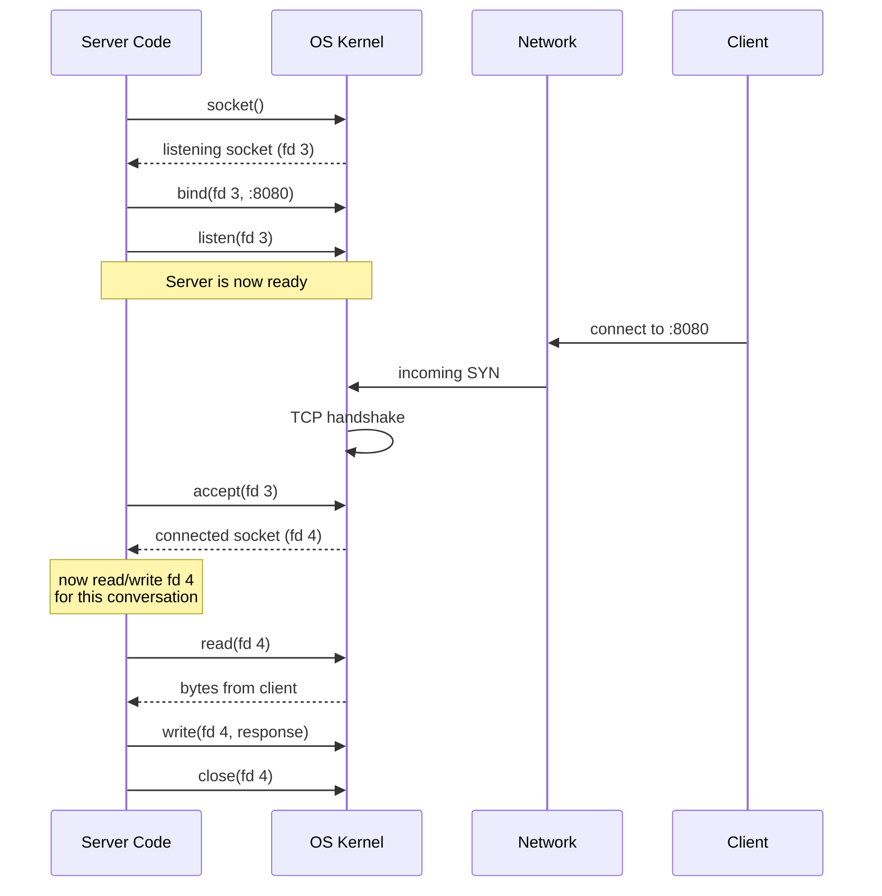
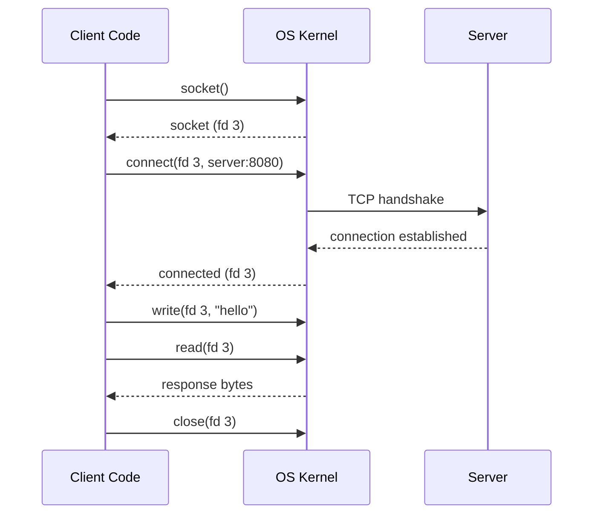

# Sockets: The OS Network Endpoint

:::tip Summary

- A **socket** is the OS's handle for a network endpoint — like a file descriptor, but for network I/O.
- A server has **one listening socket** that accepts new connections, and **one connected socket per active client**.
- Every server framework you'll ever use is, underneath, just managing sockets and deciding which thread (or event loop) reads/writes them.

:::

:::note Prerequisites

[1. Client-Server Fundamentals](./client-server-fundamentals)

:::

## What a socket actually is

A **socket** is an OS-level object that represents one end of a network conversation. When your code says "open a connection," what the OS hears is "give me a socket and connect it to that address."

The mental model that unlocks everything:

> A socket is to the network what a file descriptor is to the disk.

You `read()` and `write()` to a socket the same way you read and write a file. The OS handles the rest — routing packets, retransmitting lost ones, buffering. From your code's perspective, it's just bytes flowing in and bytes flowing out.


In Java this is the `Socket` and `ServerSocket` classes. In Python it's the `socket` module. In Go it's `net.Conn`. In C it's literally a file descriptor — an integer. They're all the same OS primitive wrapped differently.

## The 5-tuple: how the OS tells sockets apart

A socket is uniquely identified by **five things**:

| Field | Example |
|---|---|
| Protocol | TCP |
| Source IP | `203.0.113.5` |
| Source port | `54321` |
| Destination IP | `198.51.100.10` |
| Destination port | `443` |

This is called the **5-tuple**. Every active connection on a machine has a unique 5-tuple. That's how the OS decides which packet belongs to which socket — it looks up the 5-tuple.

It's also why one server can hold thousands of connections on a single port: each client has a different *source* IP+port, so the 5-tuples are all unique even though the destination (server) port is shared.

## Listening sockets vs connected sockets

A server actually deals with **two kinds** of sockets — and conflating them is the most common source of confusion.

```mermaid
graph TB
    LS["🛎️ Listening Socket<br/>:8080<br/><i>the doorbell</i>"]
    CS1["📞 Connected Socket<br/>↔ client 1<br/><i>one active conversation</i>"]
    CS2["📞 Connected Socket<br/>↔ client 2"]
    CS3["📞 Connected Socket<br/>↔ client 3"]

    LS -.->|accept()| CS1
    LS -.->|accept()| CS2
    LS -.->|accept()| CS3

    style LS fill:#2563eb,color:#fff
    style CS1 fill:#10b981,color:#fff
    style CS2 fill:#10b981,color:#fff
    style CS3 fill:#10b981,color:#fff
```

**Listening socket** (a.k.a. the "doorbell")
- The server has exactly one of these per port it serves.
- Its only job: wait for new connection requests and produce new connected sockets.
- You never read or write actual application data through it.

**Connected socket** (a.k.a. "an active call")
- One per active client connection.
- This is where actual bytes flow back and forth.
- When the client disconnects, this socket is closed and freed.

Think of it like a restaurant: the listening socket is the host stand, the connected sockets are the tables. One host stand can seat thousands of tables over a day.

## The server-side lifecycle

Every TCP server, in every language, follows the same four-step dance:



1. **`socket()`** — ask the OS for a new socket. You get back a file descriptor.
2. **`bind()`** — claim a specific port (e.g., 8080) so clients know where to find you.
3. **`listen()`** — tell the OS "I'm ready to accept incoming connections on this socket."
4. **`accept()`** — wait for the next incoming connection. When one arrives, the OS hands you a *new* socket — the connected socket — and the listening socket goes back to waiting.

Once you have the connected socket, you read and write bytes through it until either side closes the connection.

## The client-side lifecycle is simpler



A client doesn't `bind()`, `listen()`, or `accept()` — it just `connect()`s. The OS picks a random local port for the source side.

## What ports are (and why 80, 443, etc. are special)

A **port** is a 16-bit number (0–65535) that identifies a specific service on a machine. It's how the OS knows that the incoming packet for `your-machine.com:443` should go to the HTTPS server you're running, not the SSH server.

| Range | Meaning |
|---|---|
| **0–1023** | "Well-known" ports. Usually require root/admin to bind. HTTP=80, HTTPS=443, SSH=22, Postgres=5432. |
| **1024–49151** | "Registered" ports. Used by specific applications by convention. |
| **49152–65535** | "Ephemeral" ports. Picked at random by the OS for outgoing client connections. |

When you bind a server to port 8080, you're claiming that port on your machine — only one process can bind a given port at a time.

## What "the connection is closed" actually means

Either side can close a connection by calling `close()` on its socket. The OS sends a TCP `FIN` packet, the other side acknowledges, both sides free the socket. If a client disappears without closing (laptop closed, Wi-Fi dropped), the server's socket eventually hits a **timeout** and closes too — but this can take minutes by default, which matters when you're trying to detect dead clients quickly.

This is why protocols like WebSocket layer their own **ping/pong** mechanism on top of the socket — to detect dead connections faster than TCP would on its own.

## Common confusions

**"How can thousands of clients use port 443?"**
They all connect to *destination* port 443 on the server, but each client uses a different *source* port. The 5-tuple is unique even though the server-side port is shared.

**"Is a socket the same as a port?"**
No. A port is just a number that identifies a service. A socket is the actual OS object you do I/O on. One listening socket binds one port; many connected sockets share the same server port via different 5-tuples.

**"Why does my server fail with 'Address already in use'?"**
A previous instance bound the same port and the OS hasn't released it yet (the `TIME_WAIT` state — typically 30–120 seconds). Enable `SO_REUSEADDR` if you need to rebind immediately.

**"Are sockets only for TCP?"**
No. There are also UDP sockets, Unix domain sockets (same machine only, very fast), and raw sockets. TCP is just the most common.

## Why this matters for the next docs

Every server design decision boils down to "what does a thread (or event loop) do with each socket?"

- **[Threads](./threads-and-concurrency)** — how do we have many sockets being read/written at the same time?
- **[Blocking vs Non-Blocking I/O](./blocking-vs-non-blocking)** — when a `read()` has no data yet, what does the thread do? Sit and wait, or move on?

If you only remember one thing from this doc, make it this: **a server is a program that manages one listening socket and many connected sockets, and the rest is just engineering around that fact.**

---

**← Previous** [1. Client-Server Fundamentals](./client-server-fundamentals)
**Next →** [3. Threads & Server Concurrency](./threads-and-concurrency)
