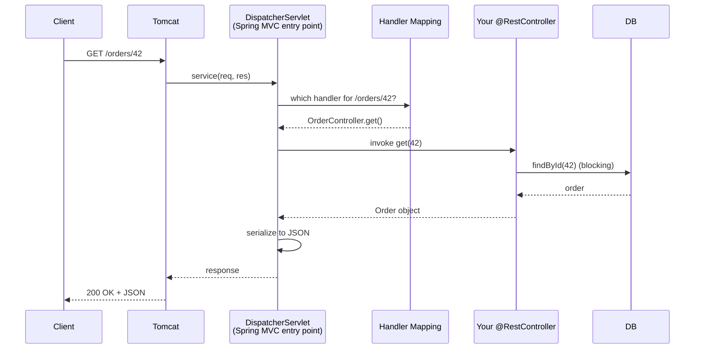
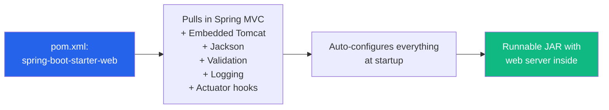
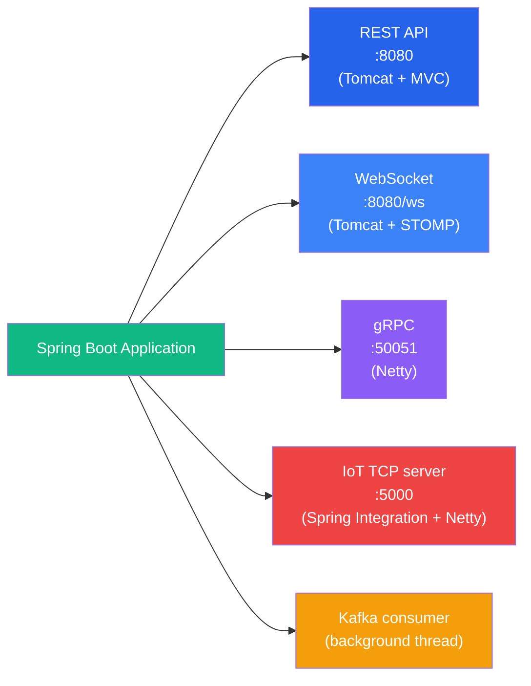

# The Spring Ecosystem & Server Choices

:::tip Summary

- **Spring** = a dependency injection / framework toolkit. Knows nothing about HTTP.
- **Spring MVC** = web framework built on the Servlet API. Sits on Tomcat (or Jetty / Undertow).
- **Spring WebFlux** = reactive web framework built on Reactor. Sits on Netty (usually).
- **Spring Boot** = an opinionated wrapper that auto-configures everything and gives you a JAR you can just run.
- **Spring Boot is NOT web-only** — there are starters for TCP, WebSocket, gRPC, messaging, batch jobs, and more.

:::

:::note Prerequisites

[7. Tomcat vs Netty](./tomcat-vs-netty) (everything else helps too)

:::

## Framework, library, engine — sorting out the words

These words get thrown around interchangeably. They're not the same thing:

| Term | What it is | Examples |
|---|---|---|
| **Library** | Code you call | Jackson (JSON), Apache HttpClient |
| **Framework** | Code that calls *you* (inversion of control) | Spring, Spring MVC, JUnit |
| **Engine** | The runtime that hosts/executes things | Tomcat, Netty, JVM |

> "Library: you're in charge. Framework: it's in charge. Engine: it runs."

Spring is a framework. Tomcat and Netty are engines. Spring MVC is a framework that runs on top of either of them.

## The Spring stack, layer by layer

```mermaid
graph TB
    subgraph Yours["YOUR CODE"]
        APP["Your @RestController / @Service / @Repository"]
    end

    subgraph SpringBoot["Spring Boot (auto-config, starters)"]
        SB["Auto-configures everything below<br/>so you don't have to"]
    end

    subgraph Frameworks["Web Framework (pick one)"]
        MVC["Spring MVC<br/>(blocking, servlet)"]
        FLUX["Spring WebFlux<br/>(reactive)"]
    end

    subgraph Core["Spring Core"]
        CORE["DI container, AOP, configuration"]
    end

    subgraph Abstractions["Abstraction"]
        SERVLET["Servlet API"]
        REACTOR["Project Reactor"]
    end

    subgraph Engines["Engine"]
        TOMCAT["Tomcat<br/>(or Jetty, Undertow)"]
        NETTY["Reactor Netty"]
    end

    APP --> SB
    SB --> MVC
    SB --> FLUX
    MVC --> CORE
    FLUX --> CORE
    MVC --> SERVLET
    FLUX --> REACTOR
    SERVLET --> TOMCAT
    REACTOR --> NETTY

    style APP fill:#2563eb,color:#fff
    style SB fill:#10b981,color:#fff
    style TOMCAT fill:#3b82f6,color:#fff
    style NETTY fill:#8b5cf6,color:#fff
```

<div style={{textAlign: 'center'}}>



</div>

Reading bottom-up:
1. **Tomcat / Netty** — the actual network listener (from [doc 7](./tomcat-vs-netty)).
2. **Servlet API / Reactor** — the standard Java interface (servlet) or reactive API the engine exposes.
3. **Spring Core** — provides the DI container that holds your beans.
4. **Spring MVC / WebFlux** — the web framework. Maps URLs to controllers, handles JSON, builds responses.
5. **Spring Boot** — wires everything together with sensible defaults so you don't have to.
6. **Your code** — `@RestController`, `@Service`, etc.

## Spring Core: not about HTTP at all

The first thing to internalise: **Spring by itself has nothing to do with web servers.** Spring is a **dependency injection container** + a bag of utilities (AOP, configuration, transaction management, etc.).

```java
@Service
class OrderService {
    private final PaymentClient payments;
    OrderService(PaymentClient payments) {  // Spring injects this
        this.payments = payments;
    }
}
```

You can use Spring for:
- A CLI tool
- A batch job
- A desktop app
- A library
- ...and oh, also web servers (via Spring MVC or WebFlux)

When people say `Spring`, they almost always mean Spring + Spring MVC + Spring Boot, but those are layered choices.

## Spring MVC: the servlet-based web framework

Spring MVC sits **on top of the Servlet API**. Under the hood:

<div style={{textAlign: 'center'}}>



</div>

- **DispatcherServlet** is the single servlet Spring registers with the container. Every request goes through it.
- It looks up the right `@Controller` method, invokes it, takes the return value, serializes it (with Jackson), and writes the response.
- The whole thing runs on a Tomcat worker thread — **blocking model**.

If you've ever written a `@RestController`, you've used Spring MVC.

### What's NOT Spring MVC vs what IS

| Yes (Spring MVC) | No (something else) |
|---|---|
| `@RestController`, `@RequestMapping` | `@Service`, `@Component` (those are Spring Core) |
| Request mapping, content negotiation | Bean wiring (Spring Core) |
| JSON serialization via Jackson | JPA/Hibernate (separate Spring Data project) |
| Filters, interceptors | Logging, scheduling (Spring Core utilities) |

## Spring WebFlux: the reactive web framework

Spring WebFlux is the **alternative** to Spring MVC. Same conceptual job (handle HTTP), completely different implementation:

| | Spring MVC | Spring WebFlux |
|---|---|---|
| **API style** | Imperative, blocking | Reactive (`Mono<T>`, `Flux<T>`) |
| **Sits on** | Servlet API | Project Reactor |
| **Default engine** | Tomcat | Reactor Netty |
| **Threading** | Thread-per-request | Event loop |
| **Controller return type** | `User` | `Mono<User>` |
| **DB driver** | JDBC (blocking) | R2DBC (reactive) |

A WebFlux controller looks like:

```java
@GetMapping("/orders/{id}")
public Mono<Order> get(@PathVariable Long id) {
    return orderRepository.findById(id);  // returns Mono<Order>
}
```

The whole chain is non-blocking — Netty event loop reads the request, Reactor schedules the work, R2DBC sends the query without blocking, the response flows back through the pipeline.

### When to pick MVC vs WebFlux

Default to **MVC**. Reach for **WebFlux** only when:
- You have **many thousands of concurrent connections** (WebSocket, SSE, long-poll)
- You're building a **proxy or gateway** that mostly forwards bytes
- You need **streaming** semantics with backpressure
- Your whole downstream stack is already reactive

Don't pick WebFlux just because *reactive sounds faster*. For typical REST APIs, MVC with virtual threads ([doc 7](./tomcat-vs-netty)) gives you 95% of the benefit with 5% of the complexity.

## Spring Boot: the opinionated wrapper

Spring Boot does **not** add new web capabilities. It adds:

1. **Starter dependencies** — one Maven/Gradle line pulls in everything you need (`spring-boot-starter-web` = Spring MVC + Tomcat + Jackson + validation + etc.).
2. **Auto-configuration** — sees what's on the classpath, configures sensible beans automatically. No XML, minimal Java config.
3. **Embedded engines** — Tomcat or Netty is *embedded* in your JAR. No external Tomcat install; just `java -jar app.jar`.
4. **Actuator** — health checks, metrics, info endpoints out of the box.
5. **Property binding** — `application.yml` → typed config classes.

<div style={{textAlign: 'center'}}>



</div>

Before Spring Boot, building a Spring web app involved a `web.xml`, an external Tomcat install, dozens of XML beans, and a deploy step. Now it's `@SpringBootApplication` + `java -jar`.

## Spring Boot is NOT web-only

This is the headline answer to one of the original questions. Spring Boot has **starter modules for many server types beyond plain HTTP**:

| Starter | Underlying engine | What you get |
|---|---|---|
| `spring-boot-starter-web` | Tomcat (servlet) | HTTP / REST with Spring MVC |
| `spring-boot-starter-webflux` | Reactor Netty | Reactive HTTP with WebFlux |
| `spring-boot-starter-websocket` | Tomcat (servlet) | WebSocket via STOMP or raw |
| `spring-boot-starter-integration` + Spring Integration TCP | Netty under the hood | **Raw TCP server** (custom protocols) |
| `spring-boot-starter-data-redis` | Lettuce / Jedis (Netty) | Redis client (not a server, but uses non-blocking I/O) |
| `spring-boot-starter-amqp` | RabbitMQ client | Message consumer/producer |
| `spring-boot-starter-kafka` | Kafka client | Stream processing |
| `spring-boot-starter-batch` | none (just JVM) | Scheduled batch jobs |
| `spring-grpc-starter` (community) | gRPC-Java (Netty) | gRPC server |

You can mix several. A typical Spring Boot service might:

<div style={{textAlign: 'center'}}>



</div>

All in one runnable JAR, all using Spring DI, all sharing the same configuration.

## Concrete examples for each server type

### A REST API server

`pom.xml`:
```xml
<dependency>
    <groupId>org.springframework.boot</groupId>
    <artifactId>spring-boot-starter-web</artifactId>
</dependency>
```

```java
@SpringBootApplication
@RestController
public class App {
    @GetMapping("/hello")
    String hello() { return "world"; }
    public static void main(String[] args) { SpringApplication.run(App.class, args); }
}
```

Engine: **Tomcat** (embedded). Concurrency: thread pool.

### A reactive HTTP server

`pom.xml`:
```xml
<dependency>
    <groupId>org.springframework.boot</groupId>
    <artifactId>spring-boot-starter-webflux</artifactId>
</dependency>
```

```java
@RestController
public class HelloController {
    @GetMapping("/hello")
    Mono<String> hello() { return Mono.just("world"); }
}
```

Engine: **Reactor Netty** (embedded). Concurrency: event loop.

### A WebSocket server

`pom.xml`:
```xml
<dependency>
    <groupId>org.springframework.boot</groupId>
    <artifactId>spring-boot-starter-websocket</artifactId>
</dependency>
```

```java
@Configuration
@EnableWebSocket
public class WsConfig implements WebSocketConfigurer {
    public void registerWebSocketHandlers(WebSocketHandlerRegistry r) {
        r.addHandler(new MyHandler(), "/ws");
    }
}
```

Engine: **Tomcat** (servlet-based). For 50k+ connections, switch to WebFlux + Reactor Netty.

### A raw TCP server (for IoT / hardware)

`pom.xml`:
```xml
<dependency>
    <groupId>org.springframework.boot</groupId>
    <artifactId>spring-boot-starter-integration</artifactId>
</dependency>
<dependency>
    <groupId>org.springframework.integration</groupId>
    <artifactId>spring-integration-ip</artifactId>
</dependency>
```

```java
@Bean
TcpNetServerConnectionFactory serverFactory() {
    return new TcpNetServerConnectionFactory(5000);
}

@Bean
TcpInboundGateway gateway(TcpNetServerConnectionFactory cf) {
    TcpInboundGateway g = new TcpInboundGateway();
    g.setConnectionFactory(cf);
    g.setRequestChannelName("tcpInbound");
    return g;
}
```

Engine: **Netty** under the hood (via Spring Integration TCP). You can also drop down to raw Netty inside a Spring Boot app for more control.

## The matrix: choosing the right server type

| I want to build... | Starter | Underlying engine | Concurrency |
|---|---|---|---|
| REST API (standard) | `starter-web` | Tomcat | Thread pool |
| REST API (high concurrency) | `starter-web` + virtual threads | Tomcat (Loom) | Virtual threads |
| Reactive REST / streaming | `starter-webflux` | Reactor Netty | Event loop |
| WebSocket (small scale) | `starter-websocket` | Tomcat | Thread pool |
| WebSocket (large scale) | `starter-webflux` | Reactor Netty | Event loop |
| gRPC server | `grpc-spring-boot-starter` | Netty | Event loop |
| Raw TCP / IoT | `starter-integration` + `spring-integration-ip` | Netty | Event loop |
| Message consumer | `starter-amqp` / `starter-kafka` | Broker client lib | Background threads |
| Scheduled jobs | `starter-batch` or `@Scheduled` | None (just JVM) | Thread pool |

## Common confusions

**Is Spring Boot a server?**
No. Spring Boot is the wrapper. The actual server is the **embedded engine** (Tomcat or Netty) that Spring Boot configures and starts.

**Can I run Spring MVC without Spring Boot?**
Yes — that's how Spring worked before 2014. You'd package a WAR file and deploy it to a standalone Tomcat. Spring Boot just bundles the engine into the JAR.

**Does WebFlux replace MVC?**
No, they're alternatives. Pick one per service. Most services should still use MVC.

**Can I mix MVC and WebFlux in one app?**
Not on the same server (one or the other handles HTTP). But you can use **WebClient** (the reactive HTTP client from WebFlux) inside an MVC app for outbound calls.

**Is Tomcat slower than Netty for the same Spring MVC code?**
The MVC code is blocking either way, so swapping engines doesn't change much. The benefit of Netty only shows up when the whole stack (Spring WebFlux, R2DBC, etc.) is non-blocking.

**What about Quarkus, Micronaut, Helidon?**
These are *alternatives to Spring Boot* — same idea (JAR with embedded server), often faster startup, smaller memory. They have similar starter ecosystems.

## Where to go next

You now have the full mental model. Next steps depend on what you're building:

- **Building a standard REST service?** Start with `spring-boot-starter-web`. Read the [Spring Boot docs](https://docs.spring.io/spring-boot/) for actuator, profiles, configuration.
- **Need real-time features?** Read [Spring WebSocket](https://docs.spring.io/spring-framework/reference/web/websocket.html) docs and the WebFlux reference.
- **Integrating with hardware?** Look at [Spring Integration TCP](https://docs.spring.io/spring-integration/reference/ip.html) or read Netty's user guide for direct use.
- **Operating any Spring Boot service?** Learn about Actuator endpoints, logging configuration, and graceful shutdown.

If anything in this series was unclear, file an issue or a TIL — that's how this knowledgebase grows.

---

**← Previous** [7. Tomcat vs Netty: Two Concurrency Models](./tomcat-vs-netty)

**🏁 You've reached the end of the [Server Architecture series](/kb/category/server-architecture).**
