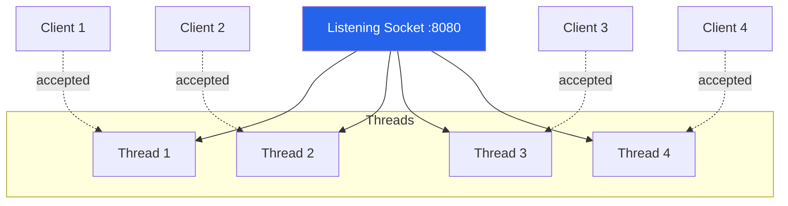
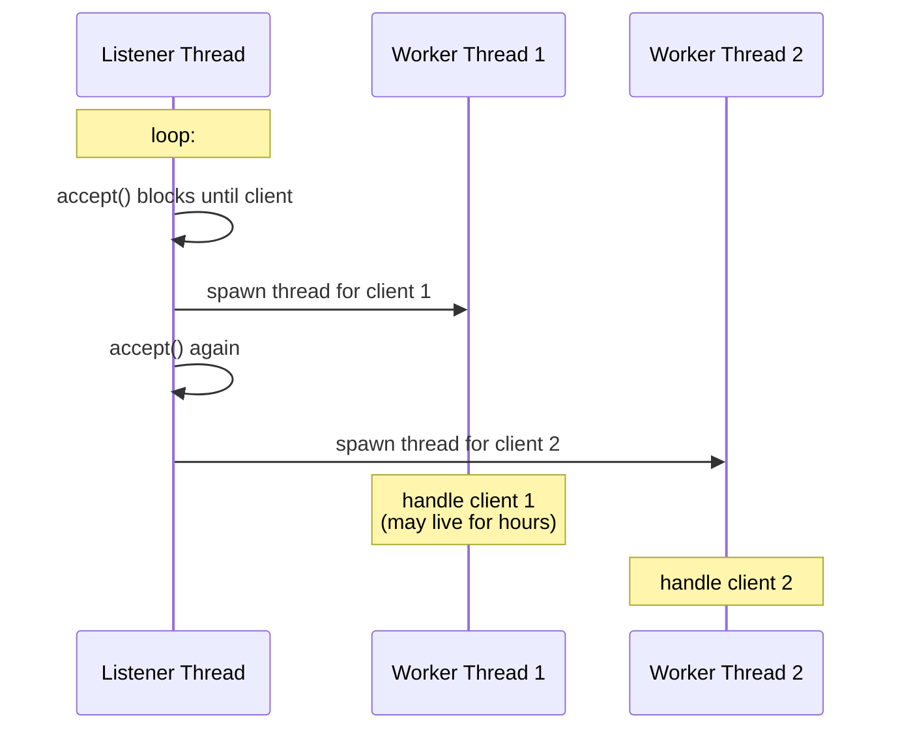
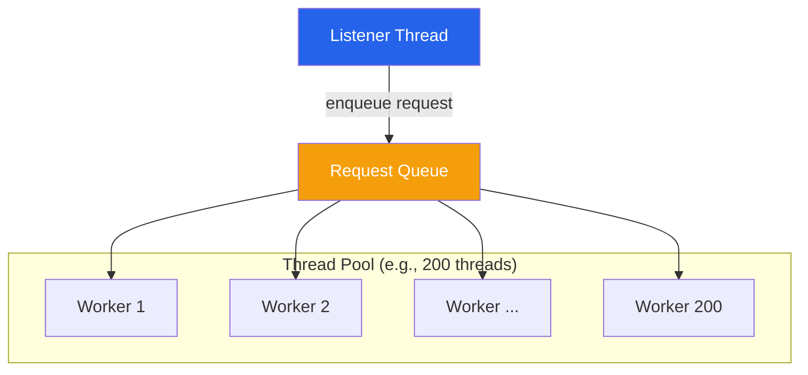
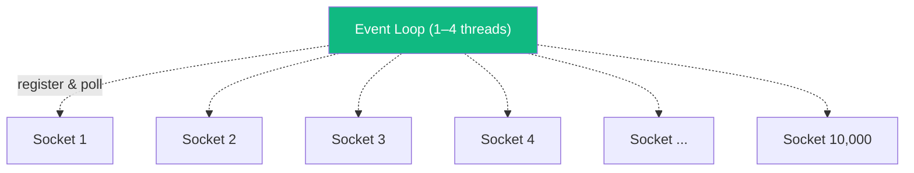
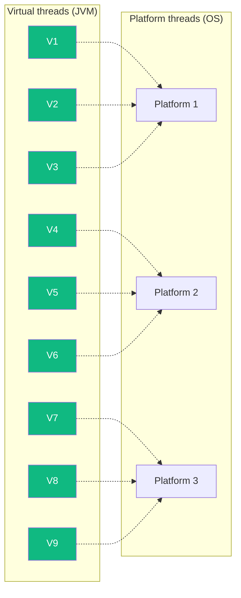

# Threads & Server Concurrency

:::tip Summary

- A **thread** is a lightweight unit of execution. A server uses threads so it can handle multiple clients at the same time.
- The classic pattern is **one thread per client (or per request)** — simple, but it doesn't scale past ~10k threads.
- The fix isn't "more threads." It's **fewer threads that each do more work** — which is what the [next doc on blocking I/O](./blocking-vs-non-blocking) is about.

:::

:::note Prerequisites

[1. Client-Server Fundamentals](./client-server-fundamentals) · [2. Sockets](./sockets)

:::

## Why threads matter for servers

A server with one thread can only do one thing at a time. If client A's request takes 200ms (database query, file read, downstream API call), then client B has to wait 200ms before the server even *looks* at their request. With 100 clients, the last one waits 20 seconds.

The fix: **do work in parallel.** That's what threads are for.

The listening socket accepts new connections and hands each one to a thread. Each thread then handles its client independently. CPU cores get to do work in parallel.

## What a thread actually is

A **thread** is a single sequence of instructions executing inside a process. A process can have many threads, and they all share the same memory (the heap), but each thread has its own stack, its own program counter, and its own local variables.

| | Process | Thread |
|---|---|---|
| **Memory** | Isolated from other processes | Shared with sibling threads |
| **Startup cost** | High (fork, set up address space) | Lower, but not free |
| **Communication** | Pipes, sockets, shared memory | Just touch shared variables (carefully!) |
| **Crash** | One process dying doesn't kill others | One thread crashing can take down the whole process |

The OS decides which thread runs on which CPU core at any given moment. With 8 cores and 800 threads, the OS rapidly switches threads on and off the cores — this is called **context switching** and it has a real cost (saving registers, flushing caches, etc.).

## The cost of a thread

A thread isn't free. On a JVM:

| Resource | Cost per thread |
|---|---|
| **Stack memory** | ~512 KB to 1 MB (default) |
| **Kernel bookkeeping** | A few KB |
| **Context switch** | ~1–10 microseconds |
| **Practical max** | ~5k–10k threads before things get bad |

10,000 threads × 1 MB = 10 GB of stack memory just for thread stacks. That alone is why "one thread per client" hits a wall.

## Three patterns for using threads in a server

### Pattern 1: Thread-per-connection (the naive approach)

One thread is born when a client connects, and dies when the client disconnects.

**Pros:** dead simple to write. Each thread just sees its own client.
**Cons:** spawning is slow, and you can't hold thousands of long-lived connections without running out of memory.

**When to use:** never in production, but it's how every networking tutorial starts.

### Pattern 2: Thread pool with thread-per-request (the classic Java web server)

A fixed pool of worker threads is created at startup. The listener accepts a request, hands it off to the pool, then immediately goes back to accepting. A worker picks up the request, processes it fully, then becomes available for the next one.

**Pros:** thread creation cost is paid once. The pool size caps memory use.
**Cons:** if all 200 workers are blocked waiting on slow downstream services, request 201 sits in the queue. Pool size is a knob you have to tune.

**When to use:** the standard pattern for traditional web servers — **this is how Tomcat works**.

### Pattern 3: Small thread pool + non-blocking I/O (event loop)

A tiny number of threads (often just one per CPU core) watch *all* sockets at once. When a socket has data, the thread reads it, runs a small piece of work, and moves on to the next ready socket. No thread is ever "blocked" waiting for a slow client.

**Pros:** can handle 100k+ concurrent connections with a handful of threads.
**Cons:** writing the code is harder (callbacks, futures, reactive streams). Any accidentally-blocking call (synchronous DB query, slow filesystem read) freezes the whole loop.

**When to use:** high-concurrency, mostly-I/O-bound workloads — **this is how Netty and Node.js work**.

## The C10k problem (and why patterns shifted)

In the late 1990s, "C10k" stood for the **challenge of serving 10,000 concurrent connections from one server**. With thread-per-connection, the OS ran out of memory and CPU long before reaching 10k. The fix turned out not to be "make threads cheaper" but "stop assigning a thread to every connection." That's what event loops do — and it's the bridge into the [next doc](./blocking-vs-non-blocking).

## The new middle ground: virtual threads (Project Loom)

Java 21 (and modern Kotlin coroutines, Go goroutines) introduced **virtual threads** — threads that the JVM (or language runtime) manages itself, not the OS. They cost a few KB each instead of 1 MB, and you can have millions of them. When one "blocks" on I/O, the runtime quietly parks it and runs another on the same OS thread.

The result: you get the simple code of thread-per-request *and* the scaling of an event loop. We'll come back to this in [doc 7](./tomcat-vs-netty).

## Comparison cheat-sheet

| Pattern | Max concurrent connections | Code complexity | Used by |
|---|---|---|---|
| Thread-per-connection | ~1k | Trivial | Tutorials only |
| Thread pool (per request) | ~10k | Easy | Tomcat, Jetty (servlet mode) |
| Event loop (non-blocking) | 100k+ | Hard (callbacks/reactive) | Netty, Node.js, nginx |
| Virtual threads | 100k+ | Easy (looks like blocking code) | Tomcat 10.1+, Spring Boot 3.2+, Helidon |

## Common confusions

**"More threads = faster server, right?"**
Only up to a point. Past the number of CPU cores, more threads mostly just increase context-switching overhead. The sweet spot depends on whether your workload is CPU-bound (few threads) or I/O-bound (more threads, but still bounded).

**"Are async/await and threads the same thing?"**
No, but they're related. `async/await` is a *programming model* for non-blocking code. Threads are an OS-level execution unit. You can have async code on top of an event loop (Node.js) or on top of virtual threads (Kotlin coroutines).

**"What happens if two threads write to the same variable?"**
Race conditions. Threads share memory, so coordinating who-touches-what (locks, atomic operations, immutability) is a whole subject of its own. Server frameworks try to keep request-scoped data on the request thread to avoid this.

## What unlocks next

The patterns above are *how* a server uses threads. But the deeper question is **what is a thread actually doing while it waits for the network?** The answer — blocking vs non-blocking I/O — is the single concept that explains why Netty exists, why Node.js is fast, and why virtual threads matter.

---

**← Previous** [2. Sockets](./sockets)
**Next →** [4. Blocking vs Non-Blocking I/O](./blocking-vs-non-blocking)
