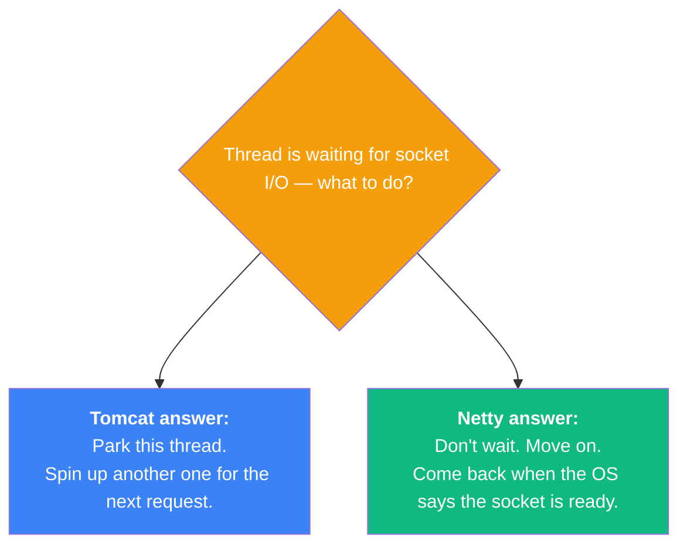
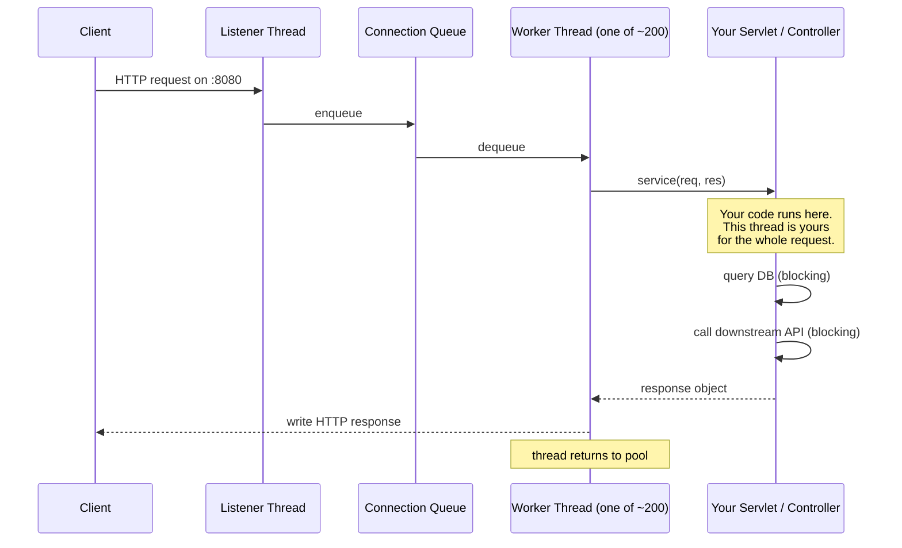
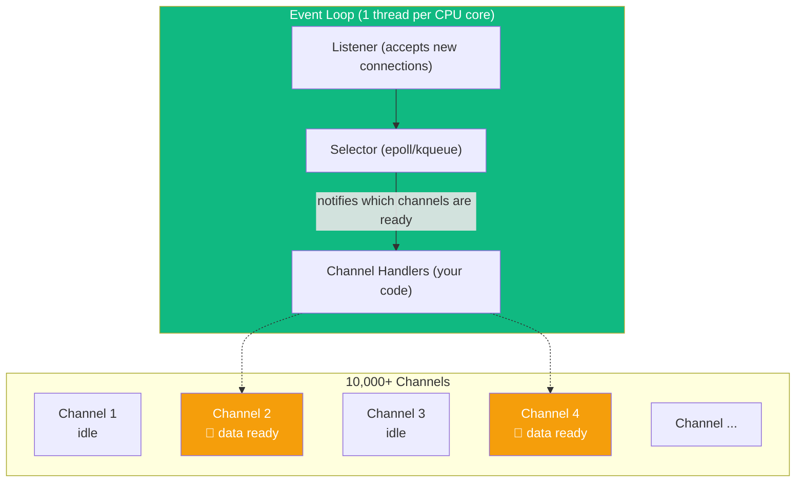
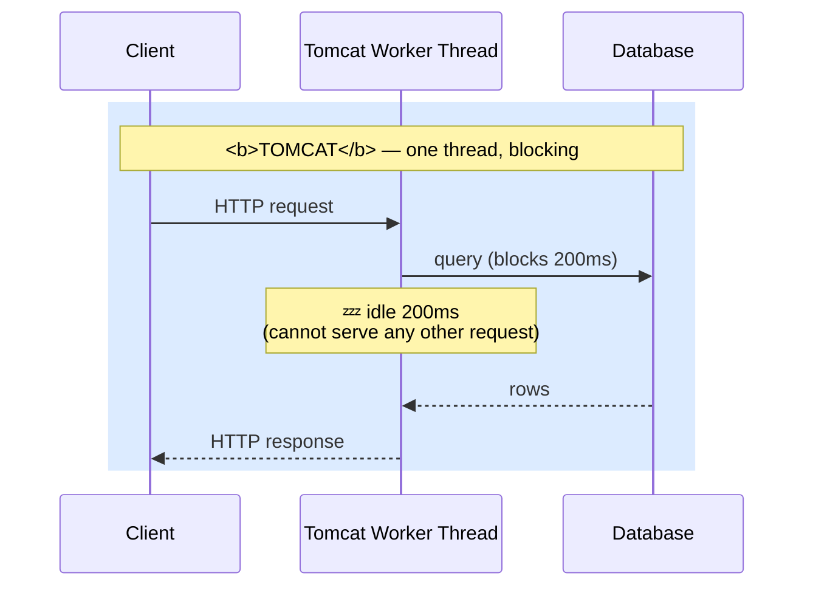
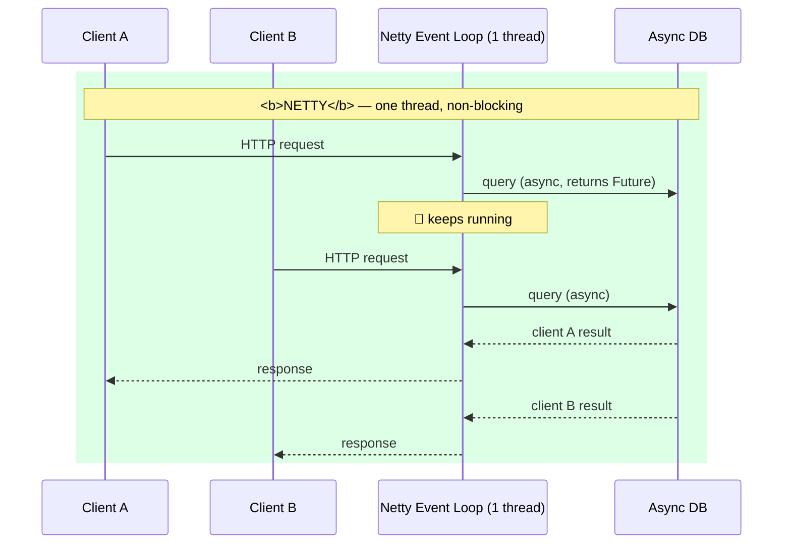
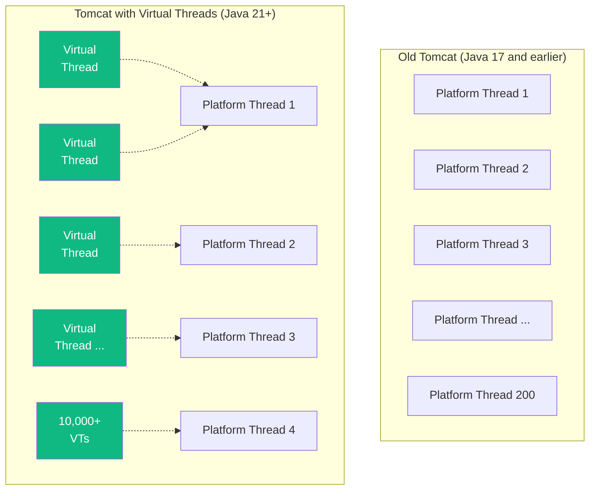

# Tomcat vs Netty: Two Concurrency Models

:::tip Summary

- **Tomcat** is a **servlet container** built on the blocking, thread-per-request model. Simple to code against; scales by adding threads.
- **Netty** is a **non-blocking networking framework** built on the event-loop model. Harder to code against; scales by handling many connections per thread.
- Java 21+ **virtual threads** are the modern third option — write blocking-style code on a Tomcat-like server with near-Netty scalability.
- The choice is mostly a concurrency-model choice, not a "which is faster" choice.

:::

:::note Prerequisites

[3. Threads & Concurrency](./threads-and-concurrency) · [4. Blocking vs Non-Blocking I/O](./blocking-vs-non-blocking) · [6. Server Types](./server-types)

:::

## Two answers to the same question

Both Tomcat and Netty solve "be a server in Java." They differ on the question from [doc 4](./blocking-vs-non-blocking): **what does a thread do while waiting for the network?**



Both are valid. Both have run production systems for two decades. Picking one is mostly about workload shape (and a little bit about taste).

---

## Tomcat: the servlet container model

### What a servlet is

A **servlet** is a Java interface (`jakarta.servlet.Servlet`) for handling HTTP requests. The contract is essentially:

```java
public interface Servlet {
    void service(ServletRequest req, ServletResponse res);
}
```

You implement `service()`, and the container calls it once per incoming request, **on a dedicated thread**.

The servlet API was standardised in 1997 and has been the foundation of Java web development ever since. Spring MVC, JSP, JSF, and dozens of other frameworks ultimately just produce servlets.

### What a servlet container is

A **servlet container** (a.k.a. "servlet engine") is the runtime that:

1. Owns the listening socket (port 8080)
2. Manages a pool of worker threads
3. Parses incoming HTTP requests
4. Routes each request to the right servlet
5. Provides the request/response objects
6. Manages session state, cookies, security

**Tomcat is the most popular servlet container.** Jetty and Undertow are the other two common ones. They're interchangeable from your code's perspective — Spring Boot can embed any of them.

### How Tomcat handles a request



Key properties:

- One thread is **dedicated to one request** from start to finish.
- Inside `service()`, you can block freely — call the DB, call an HTTP client, sleep. The thread waits; other threads keep handling other requests.
- The default Tomcat thread pool is **200 threads**. That's the practical concurrency ceiling.

### When Tomcat shines

- **Internal services with moderate concurrency** (a few hundred RPS, mostly fast requests).
- **CRUD apps** with short DB queries.
- **Teams that value simple, debuggable code** — every request has a real stack trace.
- **Existing Spring MVC apps** — this is the default it runs on.

### When Tomcat struggles

- **Tens of thousands of long-lived connections** (chat, IoT) — you run out of threads.
- **Slow downstream services** — every blocked thread is a thread the pool can't use.
- **Highly bursty traffic** — sudden spikes saturate the thread pool, requests queue up.

---

## Netty: the event-loop model

### What Netty is

Netty is a **low-level networking framework** for the JVM. It does *not* speak HTTP out of the box — it gives you the building blocks to speak any protocol on top of TCP or UDP. HTTP, WebSocket, gRPC, MQTT, custom binary — all of them have Netty-based implementations.

Netty is the engine behind:
- Spring WebFlux (via Reactor Netty)
- gRPC-Java
- Vert.x
- Apache Cassandra's networking layer
- Elasticsearch's transport layer
- Most JVM-based proxies and gateways

### How Netty handles requests: the event loop



The mental model:

- A **Channel** is Netty's wrapper around a socket.
- An **Event Loop** is one thread that watches many channels via the OS selector (`epoll` on Linux).
- A **ChannelPipeline** is a chain of handlers (your code) that runs when something happens on a channel — data arrived, connection opened, connection closed.

When a request comes in:
1. The event loop wakes up (the OS said *some* channel is ready).
2. It runs through the pipeline handlers — decode bytes → parse HTTP → call your handler → encode response → write bytes.
3. All non-blocking. Each step takes microseconds.
4. The loop moves to the next ready channel and repeats.

### What Netty code actually looks like

The handler shape is callback-based:

```java
public class MyHandler extends SimpleChannelInboundHandler<HttpRequest> {
    @Override
    protected void channelRead0(ChannelHandlerContext ctx, HttpRequest req) {
        // process request — NO BLOCKING CALLS HERE
        ctx.writeAndFlush(buildResponse(req));
    }
}
```

If your `buildResponse` needs to call a database, you can't just call it synchronously. You have to:
- Use an **async/reactive DB driver** (R2DBC instead of JDBC), or
- Hand the work off to a separate thread pool, or
- Use **Project Reactor** / **Mutiny** style reactive chains.

This is the price Netty asks for its scalability.

### When Netty shines

- **WebSocket and TCP servers** holding 10k–100k+ connections.
- **Proxies, gateways, edge servers** doing lots of small forwarding.
- **Custom protocols** (IoT, hardware, market data).
- **Low-latency** systems where you can't afford context-switching overhead.

### When Netty struggles

- **CPU-heavy work** inside the event loop — a slow handler blocks all channels on that loop.
- **Teams unfamiliar with reactive programming** — the learning curve is real.
- **Standard CRUD apps** — you're paying complexity tax for scalability you don't need.

---

## Side-by-side request flow

This single picture is what the whole doc is about:





The Tomcat thread spent 200ms doing nothing. The Netty thread served two clients in the same wall-clock time, by interleaving.

---

## Direct comparison

| | Tomcat | Netty |
|---|---|---|
| **What it is** | Servlet container | Networking framework |
| **Default protocol** | HTTP | None — bring your own |
| **I/O model** | Blocking, thread-per-request | Non-blocking, event loop |
| **Default thread pool size** | ~200 | 1 per CPU core (~4–16) |
| **Max concurrent connections** | ~thread pool size | ~hundreds of thousands |
| **Code style** | Synchronous, looks normal | Callback / reactive chains |
| **Learning curve** | Low | High |
| **Easy to write blocking code** | Yes (it's the model) | No (will hang the loop) |
| **Where it lives in Spring Boot** | `spring-boot-starter-web` | `spring-boot-starter-webflux` |
| **Best fit** | Standard web APIs | Real-time, IoT, proxies, gRPC |
| **Operational complexity** | Low | Medium |
| **Debuggability** | Easy (real stack traces) | Harder (async stack traces) |

---

## The middle ground: virtual threads (Project Loom)

Java 21 introduced **virtual threads**. They look and feel like normal threads (you write blocking-style code), but the JVM internally schedules them onto a tiny pool of OS threads — like an event loop, just hidden.



When a virtual thread does a blocking call (`socket.read()`, `Thread.sleep`, `JDBC query`), the JVM **un-mounts** it from the OS thread and runs another virtual thread on that OS thread. When the blocking call completes, the virtual thread gets re-mounted and continues.

The result: Tomcat with virtual threads can handle ~Netty-scale concurrency **without changing your code from blocking style**. Spring Boot 3.2+ supports this with one config flag.

### When to pick what (the modern decision)

| Workload | Best fit |
|---|---|
| Standard web API on Java 17 or earlier | Tomcat + Spring MVC |
| Standard web API on Java 21+ | Tomcat + Spring MVC + **virtual threads** |
| 50k+ WebSocket connections | Netty (via Spring WebFlux) |
| TCP server, IoT, custom protocol | Netty (often direct, sometimes via Spring) |
| Reactive end-to-end (backpressure, streaming) | Netty + WebFlux |
| Greenfield service, unsure | Tomcat + virtual threads — simplest and scales well |

---

## Common confusions

**"Is Tomcat slow?"**
No. Tomcat per-request latency is excellent. The thread pool model just doesn't scale to tens of thousands of *concurrent* connections. For typical RPS workloads, it's perfectly fast.

**"Is Netty always faster than Tomcat?"**
For a single request, no — sometimes slower (more overhead per request). Netty wins on **concurrency**, not per-request speed. If your service handles 100 RPS, Tomcat is just as fast and far easier to write.

**"Does Spring WebFlux always use Netty?"**
By default, yes. It can also run on Tomcat or Jetty in non-blocking mode (servlet 3.1+ supports async), but Reactor Netty is the standard.

**"Can I use Netty with Spring MVC?"**
You can swap Tomcat for Reactor Netty even on Spring MVC, but you don't get non-blocking semantics — Spring MVC is still synchronous, so Netty is wasted underneath.

**"Now that virtual threads exist, is Netty obsolete?"**
For most web APIs, virtual threads cover the use case more cheaply (no code rewrite). Netty still wins when you need **fine-grained protocol control** (custom binary protocols, low-level tuning, non-HTTP servers).

---

## Where this lands

Now you understand the two underlying engines. The final doc shows how Spring — Spring Core, Spring MVC, Spring WebFlux, Spring Boot — composes on top of them, and how Spring Boot supports server types beyond plain HTTP.

---

**← Previous** [6. Server Types & When to Use Each](./server-types)
**Next →** [8. The Spring Ecosystem & Server Choices](./spring-ecosystem)
