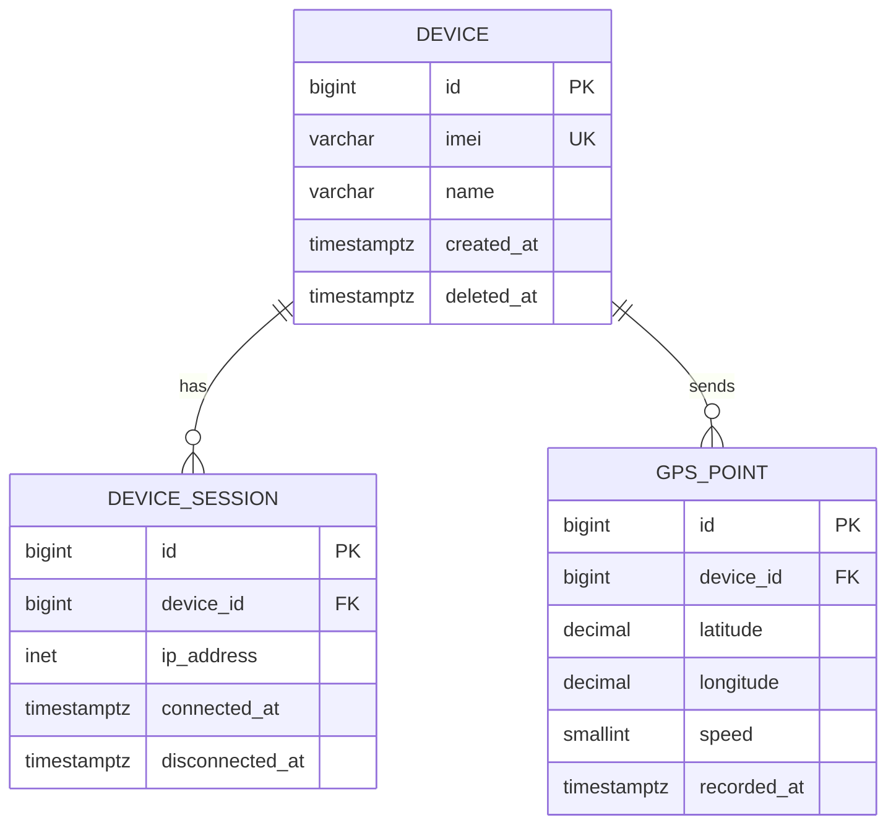

## Design Principles

- **snake_case** for all table and column names.
- Every table has a surrogate primary key (`id BIGSERIAL` or `UUID`).
- Soft deletes via `deleted_at TIMESTAMPTZ` — never `DELETE` from core entity tables.
- All timestamps are stored in UTC (`TIMESTAMPTZ`).
- Foreign keys are always indexed.

## Core Entities

_Document the main entities and their relationships. Example:_

## Naming Conventions

| Object | Convention | Example |
|---|---|---|
| Table | `snake_case` plural | `device_sessions` |
| Column | `snake_case` | `last_seen_at` |
| Index | `idx_<table>_<column>` | `idx_gps_points_device_id` |
| Foreign key | `fk_<table>_<ref>` | `fk_sessions_device_id` |

## Partitioning

_Document any partitioned tables (e.g. `gps_points` partitioned by month)._

## Related Docs

- [Migrations](./migrations.md)
- [Query Optimization](./optimization.md)
