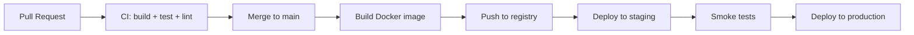

## Pipeline Overview



## CI Checks (per PR)

Every PR must pass before merge:

- [ ] Compile (Gradle build)
- [ ] Unit tests
- [ ] Integration tests
- [ ] Lint / style check (Checkstyle, ESLint)
- [ ] Docker image builds successfully

## CD Pipeline (on merge to main)

1. Docker image is built and tagged with git SHA.
2. Image is pushed to the container registry.
3. Kubernetes deployment is updated (`kubectl set image`).
4. Readiness probe confirms the rollout succeeds.
5. Smoke tests run against staging.
6. Promotion to production requires manual approval.

## Environment Promotion

| Stage | Trigger | Approval |
|---|---|---|
| Staging | Automatic on merge to `main` | None |
| Production | Manual trigger | Tech lead approval |

## Rollback

If a production deploy fails:

```bash
kubectl rollout undo deployment/<name> -n ceycode-prod
```

Or pin the previous image tag in the deployment manifest and re-deploy.

## Secrets in CI

Secrets are stored in the CI secret manager (GitHub Actions secrets / GitLab CI variables). They are injected as environment variables at build/deploy time. Never log secrets.

## Related Docs

- [Docker](./docker.md)
- [Kubernetes](./kubernetes.md)
