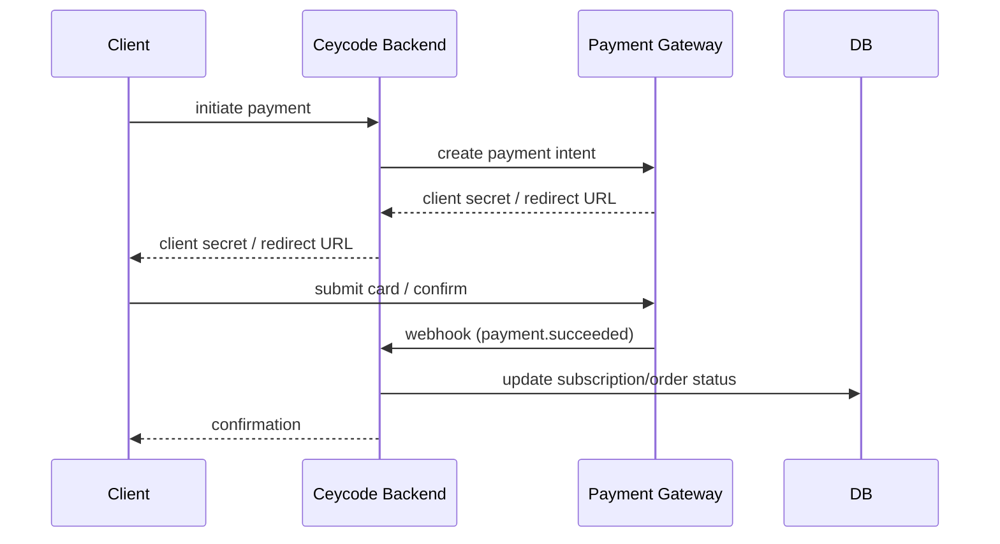

## Provider

_Document the payment provider used (Stripe, PayHere, PayPal, etc.)_

## Payment Flow

## Webhook Handling

_Document the webhook endpoint, signature verification, and idempotency handling._

## Refunds

_Document the refund process — manual vs. automated, who can trigger it, and how it's recorded._

## Testing

_Document how to test payments in staging (test card numbers, sandbox credentials)._

## Configuration

| Variable | Description |
|---|---|
| `PAYMENT_API_KEY` | Provider API key (secrets manager) |
| `PAYMENT_WEBHOOK_SECRET` | Webhook signature verification secret |
| `PAYMENT_SUCCESS_URL` | Redirect after successful payment |
| `PAYMENT_CANCEL_URL` | Redirect after cancelled payment |
