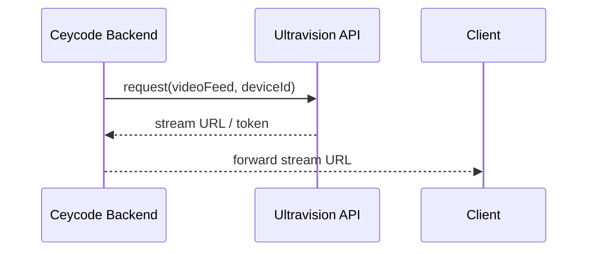

## What is Ultravision?

_Brief description of what Ultravision is and why Ceycode integrates with it._

## Integration Overview

_Describe the integration approach (REST API, SDK, TCP stream, webhook, etc.)._

## Authentication

_How does Ceycode authenticate with Ultravision? (API key, OAuth, etc.)_

## Key Capabilities Used

_List the specific Ultravision features Ceycode uses (live feed, recording retrieval, event triggers, etc.)_

## Data Flow

## Configuration

| Variable | Description |
|---|---|
| `ULTRAVISION_API_URL` | Base URL of the Ultravision API |
| `ULTRAVISION_API_KEY` | API key (stored in secrets manager) |

## Known Limitations / Gotchas

_Document any quirks, rate limits, or compatibility notes discovered during integration._

## Error Handling

_What happens when Ultravision is unreachable or returns an error?_
