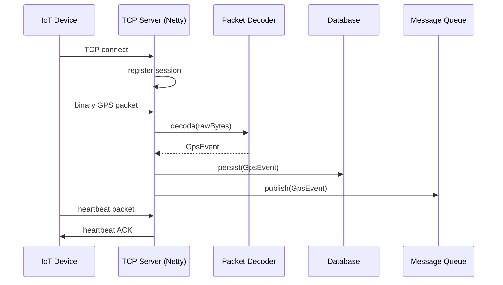

## What problem does this solve?

IoT devices (GPS trackers, fleet units) communicate over persistent TCP connections. HTTP polling wouldn't work at scale — devices need low-latency, always-on connections that survive network jitter.

## Why Netty?

Netty provides a non-blocking, event-driven I/O model that handles thousands of simultaneous device connections on a small number of threads. Spring MVC's thread-per-request model would exhaust threads at this scale.

See [ADR: TCP Server Framework Choice](../adr/) for the full decision record.

## Architecture



## Netty Pipeline

```text
[TCP Socket]
     ↓
[LengthFieldBasedFrameDecoder]   — splits raw bytes into frames
     ↓
[PacketDecoder]                  — decodes frame into domain event
     ↓
[SessionHandler]                 — manages device sessions
     ↓
[EventDispatcher]                — routes decoded events to services
```

## Packet Decoding

_Document the binary packet format(s) supported. Example:_

| Offset | Length | Field | Notes |
|---|---|---|---|
| 0 | 2 | Start marker | `0x7878` |
| 2 | 1 | Packet length | Total bytes following |
| 3 | 1 | Protocol number | Event type identifier |
| ... | ... | ... | ... |

## Session Management

Each connected device gets a `DeviceSession` object keyed by its IMEI. Sessions track:
- Connection state
- Last seen timestamp
- Device metadata

## Heartbeat Handling

Devices send a heartbeat every _N_ seconds. If no heartbeat is received within _timeout_ seconds, the session is marked inactive and the connection is closed.

## Ports

| Port | Protocol | Purpose |
|---|---|---|
| `5000` | TCP | Primary device connection port |

## Common Issues

See [Production Debugging Runbook](../runbooks/production-debugging.md).
