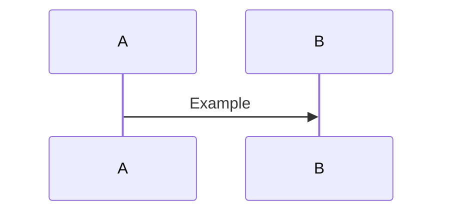

# Deep Dive: [Topic]

{/* Who is this for? What level of understanding will the reader have by the end? */}

## Background

{/* What does the reader need to understand before diving in?
    Link to existing articles rather than re-explaining. */}

## How it actually works

{/* The meat of the article. Use diagrams (Mermaid), code, and concrete examples.
    Avoid hand-waving — if you can show it, show it. */}

## The gotchas

{/* What surprises people? What does the documentation not make clear? */}

## When to use it / when not to

| Use it when | Avoid it when |
|---|---|
| | |

## Takeaways

- 
- 
- 

## Further reading

{/* Books, talks, RFCs, blog posts that go even deeper. */}
